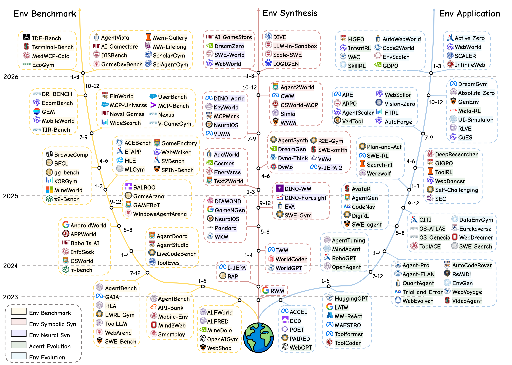
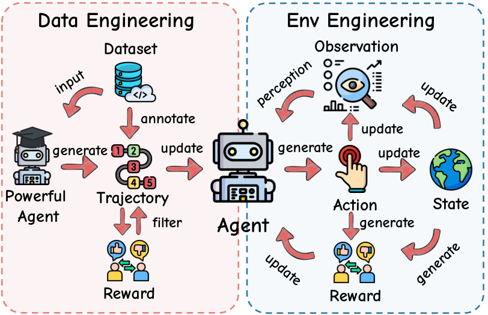
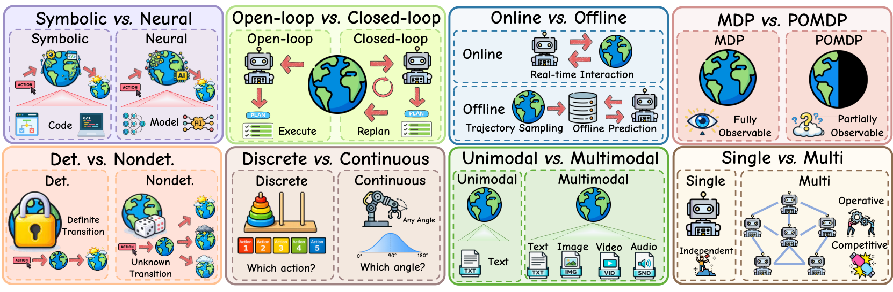
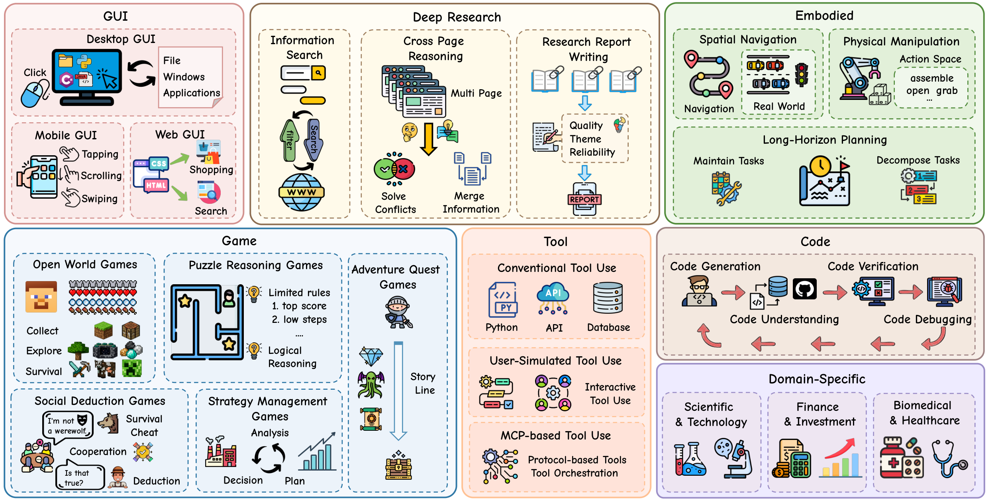
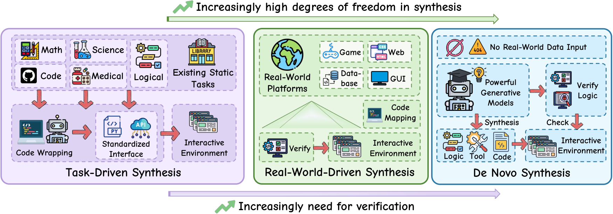
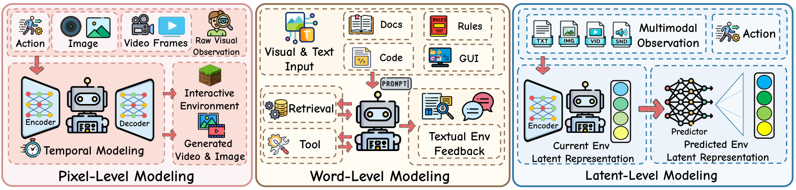
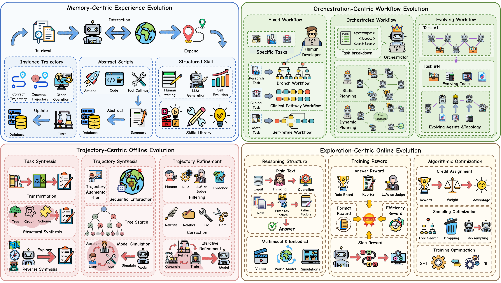
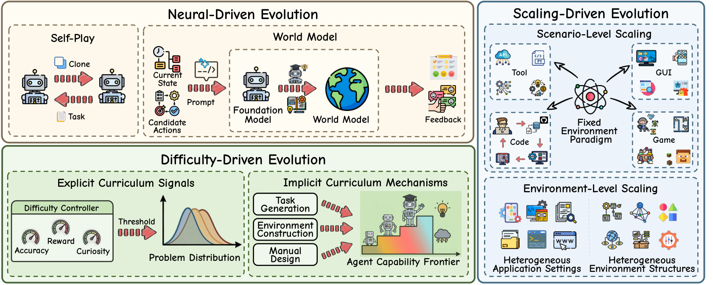

# Agentic Environment Engineering for Large Language Models

<p align="center">
  <b>A survey of environment modeling, synthesis, evaluation, application, and agent-environment co-evolution.</b>
</p>

<p align="center">
  <a href="#introduction"></a>
  <a href="#environment-attribute"></a>
  <a href="#environment-domain"></a>
  <a href="#citation"></a>
</p>

<p align="center">
  <a href="#news">News</a> |
  <a href="#table-of-content">Table of Content</a> |
  <a href="#introduction">Introduction</a> |
  <a href="#preliminaries">Preliminaries</a> |
  <a href="#environment-attribute">Attributes</a> |
  <a href="#environment-domain">Domains</a> |
  <a href="#environment-synthesis-and-evaluation">Synthesis</a> |
  <a href="#agent-evolution">Agent Evolution</a> |
  <a href="#environment-evolution">Environment Evolution</a> |
  <a href="#challenges-future-directions">Future Directions</a> |
  <a href="#citation">Citation</a> |
  <a href="#contact">Contact</a>
</p>

<p align="center">
  
</p>

## News

- [May 29, 2026]: We release the first version of our survey paper on OpenReview. [Paper](https://openreview.net/pdf?id=2p2L6LAwEN)

## Table of Content

- [News](#news)
- [Introduction](#introduction)
- [Preliminaries](#preliminaries)
- [Environment Attribute](#environment-attribute)
- [Environment Domain](#environment-domain)
- [Environment Synthesis and Evaluation](#environment-synthesis-and-evaluation)
- [Agent Evolution](#agent-evolution)
- [Environment Evolution](#environment-evolution)
- [Challenges & Future Directions](#challenges-future-directions)
- [Citation](#citation)
- [Contact](#contact)

## Introduction

This repository accompanies the survey **Agentic Environment Engineering for Large Language Models**. The survey studies agentic environments as dynamic, interactive systems for evaluating and training LLM agents, and organizes the field around environment modeling, automated environment synthesis, environment evaluation, and agent-environment co-evolution.

The paper is organized around three research questions: what characteristics and categories define agentic environments, how agentic environments can be systematically constructed and evaluated, and how environments facilitate the closed-loop co-evolution of agents and environments.

> Paper: [OpenReview PDF](https://openreview.net/pdf?id=2p2L6LAwEN)

| Research question | Covered modules |
| --- | --- |
| What are the key characteristics and categories of agentic environments? | Environment Attribute; Environment Domain |
| How can agentic environments be constructed and evaluated? | Environment Synthesis and Evaluation |
| How do environments support agent-environment co-evolution? | Agent Evolution; Environment Evolution; Challenges & Future Directions |

### Related Papers

#### Related Work and Motivation

1. **Qwen3 Technical Report**, *Qwen Team et al.*, arXiv 2025. [Paper](https://doi.org/10.48550/arXiv.2505.09388)
2. **DeepSeek-R1: Incentivizing Reasoning Capability in LLMs via Reinforcement Learning**, *DeepSeek-AI et al.*, arXiv 2025. [Paper](https://doi.org/10.48550/arXiv.2501.12948)
3. **GEM: A Gym for Agentic LLMs**, *Liu et al.*, arXiv 2025. [Paper](https://doi.org/10.48550/arXiv.2510.01051)
4. **Humanity's Last Code Exam: Can Advanced LLMs Conquer Human's Hardest Code Competition?**, *Li et al.*, Findings of EMNLP 2025. [Paper](https://aclanthology.org/2025.findings-emnlp.1152/)
5. **Introducing GPT-5.4**, *OpenAI et al.*, OpenAI 2025. [Paper](https://openai.com/index/introducing-gpt-5-4/)
6. **Gemini 3.1 Pro**, *Google DeepMind et al.*, Google DeepMind 2025. [Paper](https://deepmind.google/models/gemini/pro/)
7. **Kimi K2.5: Visual Agentic Intelligence**, *Kimi Team et al.*, arXiv 2026. [Paper](https://doi.org/10.48550/arXiv.2602.02276)
8. **ToolRL: Reward is All Tool Learning Needs**, *Qian et al.*, arXiv 2025. [Paper](https://doi.org/10.48550/arXiv.2504.13958)
9. **TravelPlanner: A Benchmark for Real-World Planning with Language Agents**, *Xie et al.*, ICML 2024. [Paper](https://proceedings.mlr.press/v235/xie24j.html)
10. **Self-Refine: Iterative Refinement with Self-Feedback**, *Madaan et al.*, NeurIPS 2023. [Paper](http://papers.nips.cc/paper_files/paper/2023/hash/91edff07232fb1b55a505a9e9f6c0ff3-Abstract-Conference.html)
11. **Agent world model: Infinity synthetic environments for agentic reinforcement learning**, *Wang et al.*, arXiv 2026. [Paper](https://arxiv.org/abs/2602.10090)
12. **RWKU: Benchmarking Real-World Knowledge Unlearning for Large Language Models**, *Jin et al.*, NeurIPS 2024. [Paper](https://arxiv.org/abs/2406.10890)
13. **A Troublemaker with Contagious Jailbreak Makes Chaos in Honest Towns**, *Men et al.*, ACL 2025. [Paper](https://aclanthology.org/2025.acl-long.859/)
14. **DAComp: Benchmarking Data Agents across the Full Data Intelligence Lifecycle**, *Lei et al.*, arXiv 2025. [Paper](https://arxiv.org/abs/2512.04324)
15. **WebShop: Towards Scalable Real-World Web Interaction with Grounded Language Agents**, *Yao et al.*, NeurIPS 2022. [Paper](http://papers.nips.cc/paper_files/paper/2022/hash/82ad13ec01f9fe44c01cb91814fd7b8c-Abstract-Conference.html)
16. **SWE-bench: Can Language Models Resolve Real-world Github Issues?**, *Jimenez et al.*, ICLR 2024. [Paper](https://openreview.net/forum?id=VTF8yNQM66)
17. **ReAct: Synergizing Reasoning and Acting in Language Models**, *Yao et al.*, ICLR 2023. [Paper](https://openreview.net/forum?id=WE_vluYUL-X)
18. **Fixing the Broken Compass: Diagnosing and Improving Inference-Time Reward Modeling**, *Li et al.*, arXiv 2025. [Paper](https://arxiv.org/abs/2503.05188)
19. **Omni-Reward: Towards Generalist Omni-Modal Reward Modeling with Free-Form Preferences**, *Jin et al.*, arXiv 2025. [Paper](https://arxiv.org/abs/2510.23451)
20. **DeepSeekMath: Pushing the Limits of Mathematical Reasoning in Open Language Models**, *Shao et al.*, arXiv 2024. [Paper](https://doi.org/10.48550/arXiv.2402.03300)
21. **DAPO: An Open-Source LLM Reinforcement Learning System at Scale**, *Yu et al.*, arXiv 2025. [Paper](https://doi.org/10.48550/arXiv.2503.14476)
22. **Reinforced internal-external knowledge synergistic reasoning for efficient adaptive search agent**, *Huang et al.*, arXiv 2025. [Paper](https://arxiv.org/abs/2505.07596)
23. **Towards agentic self-learning llms in search environment**, *Sun et al.*, arXiv 2025. [Paper](https://arxiv.org/abs/2510.14253)
24. **Agentic Reasoning for Large Language Models**, *Wei et al.*, arXiv 2026. [Paper](https://doi.org/10.48550/arXiv.2601.12538)
25. **Large language models for planning: A comprehensive and systematic survey**, *Cao et al.*, arXiv 2025. [Paper](https://arxiv.org/abs/2505.19683)
26. **A Survey of Recent Advances in Commonsense Knowledge Acquisition: Methods and Resources**, *Wang et al.*, Machine Intelligence Research 2025. [Paper](https://doi.org/10.1007/s11633-023-1471-3)
27. **WorkArena: How Capable are Web Agents at Solving Common Knowledge Work Tasks?**, *Drouin et al.*, ICML 2024. [Paper](https://proceedings.mlr.press/v235/drouin24a.html)
28. **OSWorld: Benchmarking Multimodal Agents for Open-Ended Tasks in Real Computer Environments**, *Xie et al.*, NeurIPS 2024. [Paper](http://papers.nips.cc/paper_files/paper/2024/hash/5d413e48f84dc61244b6be550f1cd8f5-Abstract-Datasets_and_Benchmarks_Track.html)
29. **Measuring short-form factuality in large language models**, *Wei et al.*, arXiv 2024. [Paper](https://arxiv.org/abs/2411.04368)
30. **GAIA: a benchmark for General AI Assistants**, *Mialon et al.*, ICLR 2024. [Paper](https://openreview.net/forum?id=fibxvahvs3)
31. **BrowseComp: A Simple Yet Challenging Benchmark for Browsing Agents**, *Wei et al.*, arXiv 2025. [Paper](https://doi.org/10.48550/arXiv.2504.12516)
32. **ALFRED: A Benchmark for Interpreting Grounded Instructions for Everyday Tasks**, *Shridhar et al.*, CVPR 2020. [Paper](https://openaccess.thecvf.com/content_CVPR_2020/html/Shridhar_ALFRED_A_Benchmark_for_Interpreting_Grounded_Instructions_for_Everyday_Tasks_CVPR_2020_paper.html)
33. **ALFWorld: Aligning Text and Embodied Environments for Interactive Learning**, *Shridhar et al.*, ICLR 2021. [Paper](https://openreview.net/forum?id=0IOX0YcCdTn)
34. **ScienceWorld: Is your Agent Smarter than a 5th Grader?**, *Wang et al.*, EMNLP 2022. [Paper](https://doi.org/10.18653/v1/2022.emnlp-main.775)
35. **GameArena: Evaluating LLM Reasoning through Live Computer Games**, *Hu et al.*, arXiv 2025. [Paper](https://arxiv.org/abs/2412.06394)
36. **Baba Is AI: Break the Rules to Beat the Benchmark**, *Cloos et al.*, arXiv 2025. [Paper](https://arxiv.org/abs/2407.13729)
37. **GameBench: Evaluating Strategic Reasoning Abilities of LLM Agents**, *Costarelli et al.*, arXiv 2024. [Paper](https://arxiv.org/abs/2406.06613)
38. **ToolLLM: Facilitating Large Language Models to Master 16000+ Real-world APIs**, *Qin et al.*, ICLR 2024. [Paper](https://openreview.net/forum?id=dHng2O0Jjr)
39. **tau-bench: A Benchmark for Tool-Agent-User Interaction in Real-World Domains**, *Yao et al.*, arXiv 2024. [Paper](https://doi.org/10.48550/arXiv.2406.12045)
40. **API-Bank: A Comprehensive Benchmark for Tool-Augmented LLMs**, *Li et al.*, EMNLP 2023. [Paper](https://doi.org/10.18653/v1/2023.emnlp-main.187)
41. **Program synthesis with large language models**, *Austin et al.*, arXiv 2021. [Paper](https://arxiv.org/abs/2108.07732)
42. **Terminal-Bench: Benchmarking Agents on Hard, Realistic Tasks in Command Line Interfaces**, *Merrill et al.*, arXiv 2026. [Paper](https://doi.org/10.48550/arXiv.2601.11868)
43. **Kernelbench: Can llms write efficient gpu kernels?**, *Ouyang et al.*, arXiv 2025. [Paper](https://arxiv.org/abs/2502.10517)
44. **MedAgentBench: Dataset for Benchmarking LLMs as Agents in Medical Applications**, *Jiang et al.*, arXiv 2025. [Paper](https://doi.org/10.48550/arXiv.2501.14654)
45. **ScienceAgentBench: Toward Rigorous Assessment of Language Agents for Data-Driven Scientific Discovery**, *Chen et al.*, ICLR 2025. [Paper](https://openreview.net/forum?id=6z4YKr0GK6)
46. **DSBench: How Far Are Data Science Agents from Becoming Data Science Experts?**, *Jing et al.*, ICLR 2025. [Paper](https://openreview.net/forum?id=DSsSPr0RZJ)
47. **Openai gym**, *Brockman et al.*, arXiv 2016. [Paper](https://arxiv.org/abs/1606.01540)
48. **AgentBench: Evaluating LLMs as Agents**, *Liu et al.*, ICLR 2024. [Paper](https://openreview.net/forum?id=zAdUB0aCTQ)
49. **AgentsCourt: Building Judicial Decision-Making Agents with Court Debate Simulation and Legal Knowledge Augmentation**, *He et al.*, Findings of EMNLP 2024. [Paper](https://arxiv.org/abs/2403.02959)
50. **MMR-V: What's Left Unsaid? A Benchmark for Multimodal Deep Reasoning in Videos**, *Zhu et al.*, arXiv 2025. [Paper](https://arxiv.org/abs/2506.04141)
51. **MMR-Life: Piecing Together Real-life Scenes for Multimodal Multi-image Reasoning**, *Li et al.*, arXiv 2026. [Paper](https://arxiv.org/abs/2603.02024)

## Preliminaries

The survey defines an environment as a stochastic dynamical system with which an agent interacts, commonly formalized as a POMDP with state space, action space, transition function, reward function, observation space, observation function, and discount factor. In this setting, an LLM agent selects actions from its interaction history, receives observations and rewards, and improves its policy through environment-agent alignment.

A central motivation is the shift from static data engineering to environment engineering. Instead of learning only from fixed corpora or pre-collected trajectories, agents can learn through dynamic interaction, feedback, and curriculum-like adjustment of task complexity.

| Perspective | Traditional data engineering | Environment engineering |
| --- | --- | --- |
| Learning source | Static corpus or pre-collected trajectories | Dynamic interaction with an environment |
| Interaction pattern | Single-turn question answering | Multi-turn interaction with tools, executors, retrievers, or agents |
| Feedback loop | Open-loop learning against fixed answers | Closed-loop feedback from state changes and rewards |
| Adaptation | Fixed data difficulty | Task complexity can be adjusted with agent capability |

<p align="center">
  
</p>

### Related Papers

#### Environment-Agent Foundations

1. **ALFWorld: Aligning Text and Embodied Environments for Interactive Learning**, *Shridhar et al.*, ICLR 2021. [Paper](https://openreview.net/forum?id=0IOX0YcCdTn)
2. **MLE-bench: Evaluating Machine Learning Agents on Machine Learning Engineering**, *Chan et al.*, ICLR 2025. [Paper](https://openreview.net/forum?id=6s5uXNWGIh)
3. **Openai gym**, *Brockman et al.*, arXiv 2016. [Paper](https://arxiv.org/abs/1606.01540)
4. **ToolACE: Winning the Points of LLM Function Calling**, *Liu et al.*, ICLR 2025. [Paper](https://openreview.net/forum?id=8EB8k6DdCU)
5. **Toolformer: Language Models Can Teach Themselves to Use Tools**, *Schick et al.*, NeurIPS 2023. [Paper](http://papers.nips.cc/paper_files/paper/2023/hash/d842425e4bf79ba039352da0f658a906-Abstract-Conference.html)
6. **ToolRL: Reward is All Tool Learning Needs**, *Qian et al.*, arXiv 2025. [Paper](https://doi.org/10.48550/arXiv.2504.13958)
7. **SWE-bench: Can Language Models Resolve Real-world Github Issues?**, *Jimenez et al.*, ICLR 2024. [Paper](https://openreview.net/forum?id=VTF8yNQM66)
8. **Terminal-Bench: Benchmarking Agents on Hard, Realistic Tasks in Command Line Interfaces**, *Merrill et al.*, arXiv 2026. [Paper](https://doi.org/10.48550/arXiv.2601.11868)
9. **Livecodebench: Holistic and contamination free evaluation of large language models for code**, *Jain et al.*, arXiv 2024. [Paper](https://arxiv.org/abs/2403.07974)
10. **WebShop: Towards Scalable Real-World Web Interaction with Grounded Language Agents**, *Yao et al.*, NeurIPS 2022. [Paper](http://papers.nips.cc/paper_files/paper/2022/hash/82ad13ec01f9fe44c01cb91814fd7b8c-Abstract-Conference.html)
11. **WebArena: A Realistic Web Environment for Building Autonomous Agents**, *Zhou et al.*, ICLR 2024. [Paper](https://openreview.net/forum?id=oKn9c6ytLx)
12. **WebVoyager: Building an End-to-End Web Agent with Large Multimodal Models**, *He et al.*, ACL 2024. [Paper](https://doi.org/10.18653/v1/2024.acl-long.371)
13. **LLMArena: Assessing Capabilities of Large Language Models in Dynamic Multi-Agent Environments**, *Chen et al.*, arXiv 2024. [Paper](https://arxiv.org/abs/2402.16499)
14. **Humanity's Last Code Exam: Can Advanced LLMs Conquer Human's Hardest Code Competition?**, *Li et al.*, Findings of EMNLP 2025. [Paper](https://aclanthology.org/2025.findings-emnlp.1152/)
15. **GAIA: a benchmark for General AI Assistants**, *Mialon et al.*, ICLR 2024. [Paper](https://openreview.net/forum?id=fibxvahvs3)
16. **ToolLLM: Facilitating Large Language Models to Master 16000+ Real-world APIs**, *Qin et al.*, ICLR 2024. [Paper](https://openreview.net/forum?id=dHng2O0Jjr)
17. **Large language models can self-improve at web agent tasks**, *Patel et al.*, arXiv 2024. [Paper](https://arxiv.org/abs/2405.20309)
18. **DeepSeek-R1: Incentivizing Reasoning Capability in LLMs via Reinforcement Learning**, *DeepSeek-AI et al.*, arXiv 2025. [Paper](https://doi.org/10.48550/arXiv.2501.12948)
19. **Group-in-Group Policy Optimization for LLM Agent Training**, *Feng et al.*, arXiv 2025. [Paper](https://doi.org/10.48550/arXiv.2505.10978)
20. **Agentic Reinforced Policy Optimization**, *Dong et al.*, arXiv 2025. [Paper](https://doi.org/10.48550/arXiv.2507.19849)
21. **Search-R1: Training LLMs to Reason and Leverage Search Engines with Reinforcement Learning**, *Jin et al.*, arXiv 2025. [Paper](https://doi.org/10.48550/arXiv.2503.09516)
22. **Proximal Policy Optimization Algorithms**, *Schulman et al.*, arXiv 2017. [Paper](http://arxiv.org/abs/1707.06347)
23. **DeepSeekMath: Pushing the Limits of Mathematical Reasoning in Open Language Models**, *Shao et al.*, arXiv 2024. [Paper](https://doi.org/10.48550/arXiv.2402.03300)
24. **DAPO: An Open-Source LLM Reinforcement Learning System at Scale**, *Yu et al.*, arXiv 2025. [Paper](https://doi.org/10.48550/arXiv.2503.14476)
25. **AgentGen: Enhancing Planning Abilities for Large Language Model based Agent via Environment and Task Generation**, *Hu et al.*, arXiv 2024. [Paper](https://doi.org/10.48550/arXiv.2408.00764)
26. **Scaling Agent Learning via Experience Synthesis**, *Chen et al.*, arXiv 2025. [Paper](https://doi.org/10.48550/arXiv.2511.03773)
27. **SCALER:Synthetic Scalable Adaptive Learning Environment for Reasoning**, *Xu et al.*, arXiv 2026. [Paper](https://doi.org/10.48550/arXiv.2601.04809)
28. **Training Verifiers to Solve Math Word Problems**, *Cobbe et al.*, arXiv 2021. [Paper](https://arxiv.org/abs/2110.14168)
29. **Measuring Massive Multitask Language Understanding**, *Hendrycks et al.*, ICLR 2021. [Paper](https://openreview.net/forum?id=d7KBjmI3GmQ)
30. **MMMU: A Massive Multi-discipline Multimodal Understanding and Reasoning Benchmark for Expert AGI**, *Yue et al.*, arXiv 2023. [Paper](https://doi.org/10.48550/arXiv.2311.16502)
31. **RAG-RewardBench: Benchmarking Reward Models in Retrieval Augmented Generation for Preference Alignment**, *Jin et al.*, Findings of ACL 2025. [Paper](https://arxiv.org/abs/2412.13746)
32. **IDE-Bench: Evaluating Large Language Models as IDE Agents on Real-World Software Engineering Tasks**, *Mateega et al.*, arXiv 2026. [Paper](https://arxiv.org/abs/2601.20886)
33. **WideSearch: Benchmarking Agentic Broad Info-Seeking**, *Wong et al.*, arXiv 2025. [Paper](https://doi.org/10.48550/arXiv.2508.07999)
34. **BrowseComp: A Simple Yet Challenging Benchmark for Browsing Agents**, *Wei et al.*, arXiv 2025. [Paper](https://doi.org/10.48550/arXiv.2504.12516)
35. **RoboFactory: Exploring Embodied Agent Collaboration with Compositional Constraints**, *Qin et al.*, arXiv 2025. [Paper](https://doi.org/10.48550/arXiv.2503.16408)
36. **Unlocking the Future: Exploring Look-Ahead Planning Mechanistic Interpretability in Large Language Models**, *Men et al.*, EMNLP 2024. [Paper](https://aclanthology.org/2024.emnlp-main.440/)
37. **MCPVerse: An Expansive, Real-World Benchmark for Agentic Tool Use**, *Lei et al.*, arXiv 2025. [Paper](https://doi.org/10.48550/arXiv.2508.16260)
38. **AutoFlow: Automated Workflow Generation for Large Language Model Agents**, *Li et al.*, arXiv 2024. [Paper](https://doi.org/10.48550/arXiv.2407.12821)
39. **Learning on the Job: An Experience-Driven Self-Evolving Agent for Long-Horizon Tasks**, *Yang et al.*, arXiv 2025. [Paper](https://doi.org/10.48550/arXiv.2510.08002)
40. **In-the-Flow Agentic System Optimization for Effective Planning and Tool Use**, *Li et al.*, arXiv 2025. [Paper](https://doi.org/10.48550/arXiv.2510.05592)
41. **Adaptation of agentic ai**, *Jiang et al.*, arXiv 2025. [Paper](https://arxiv.org/abs/2512.16301)
42. **Agentic Reasoning for Large Language Models**, *Wei et al.*, arXiv 2026. [Paper](https://doi.org/10.48550/arXiv.2601.12538)
43. **A Comprehensive Survey on Reinforcement Learning-based Agentic Search: Foundations, Roles, Optimizations, Evaluations, and Applications**, *Lin et al.*, arXiv 2025. [Paper](https://doi.org/10.48550/arXiv.2510.16724)
44. **A Comprehensive Survey of Self-Evolving AI Agents: A New Paradigm Bridging Foundation Models and Lifelong Agentic Systems**, *Fang et al.*, arXiv 2025. [Paper](https://doi.org/10.48550/arXiv.2508.07407)
45. **The Landscape of Agentic Reinforcement Learning for LLMs: A Survey**, *Zhang et al.*, Trans. Mach. Learn. Res 2026. [Paper](https://openreview.net/forum?id=RY19y2RI1O)
46. **Toward Efficient Agents: Memory, Tool learning, and Planning**, *Yang et al.*, arXiv 2026. [Paper](https://arxiv.org/abs/2601.14192)
47. **A Survey of Self-Evolving Agents: What, When, How, and Where to Evolve on the Path to Artificial Super Intelligence**, *Gao et al.*, Trans. Mach. Learn. Res 2026. [Paper](https://openreview.net/forum?id=CTr3bovS5F)

## Environment Attribute

The survey characterizes agentic environments through eight attributes that determine how agents perceive, interact with, and make decisions in environments: representation, feedback, timing, observability, stochasticity, continuity, modality, and cardinality.

| Attribute | Categories used in the survey |
| --- | --- |
| Representation | Symbolic vs. neural |
| Feedback | Open-loop vs. closed-loop |
| Timing | Online vs. offline |
| Observability | MDP vs. POMDP |
| Stochasticity | Deterministic vs. nondeterministic |
| Continuity | Discrete vs. continuous |
| Modality | Unimodal vs. multimodal |
| Cardinality | Single-agent vs. multi-agent |

<p align="center">
  
</p>

### Related Papers

#### Symbolic vs. Neural

1. **Agent world model: Infinity synthetic environments for agentic reinforcement learning**, *Wang et al.*, arXiv 2026. [Paper](https://arxiv.org/abs/2602.10090)
2. **EnvScaler: Scaling Tool-Interactive Environments for LLM Agent via Programmatic Synthesis**, *Song et al.*, arXiv 2026. [Paper](https://doi.org/10.48550/arXiv.2601.05808)
3. **AutoEnv: Automated Environments for Measuring Cross-Environment Agent Learning**, *Zhang et al.*, arXiv 2025. [Paper](https://doi.org/10.48550/arXiv.2511.19304)
4. **Is Your LLM Secretly a World Model of the Internet? Model-Based Planning for Web Agents**, *Gu et al.*, Trans. Mach. Learn. Res 2025. [Paper](https://openreview.net/forum?id=c6l7yA0HSq)
5. **Dreamgen: Unlocking generalization in robot learning through video world models**, *Jang et al.*, arXiv 2025. [Paper](https://arxiv.org/abs/2505.12705)
6. **WebEvolver: Enhancing Web Agent Self-Improvement with Co-evolving World Model**, *Fang et al.*, EMNLP 2025. [Paper](https://doi.org/10.18653/v1/2025.emnlp-main.454)

#### Open-Loop vs. Closed-Loop

1. **TaskLAMA: Probing the Complex Task Understanding of Language Models**, *Yuan et al.*, AAAI 2024. [Paper](https://doi.org/10.1609/aaai.v38i17.29918)
2. **HuggingGPT: Solving AI Tasks with ChatGPT and its Friends in Hugging Face**, *Shen et al.*, NeurIPS 2023. [Paper](http://papers.nips.cc/paper_files/paper/2023/hash/77c33e6a367922d003ff102ffb92b658-Abstract-Conference.html)
3. **TaskBench: Benchmarking Large Language Models for Task Automation**, *Shen et al.*, NeurIPS 2024. [Paper](http://papers.nips.cc/paper_files/paper/2024/hash/085185ea97db31ae6dcac7497616fd3e-Abstract-Datasets_and_Benchmarks_Track.html)
4. **Mobile-Bench: An Evaluation Benchmark for LLM-based Mobile Agents**, *Deng et al.*, ACL 2024. [Paper](https://aclanthology.org/2024.acl-long.478/)
5. **MCPVerse: An Expansive, Real-World Benchmark for Agentic Tool Use**, *Lei et al.*, arXiv 2025. [Paper](https://doi.org/10.48550/arXiv.2508.16260)
6. **WebWalker: Benchmarking LLMs in Web Traversal**, *Wu et al.*, ACL 2025. [Paper](https://aclanthology.org/2025.acl-long.508/)

#### Online vs. Offline

1. **WebArena: A Realistic Web Environment for Building Autonomous Agents**, *Zhou et al.*, ICLR 2024. [Paper](https://openreview.net/forum?id=oKn9c6ytLx)
2. **EmbodiedBench: Comprehensive Benchmarking Multi-modal Large Language Models for Vision-Driven Embodied Agents**, *Yang et al.*, ICML 2025. [Paper](https://proceedings.mlr.press/v267/yang25f.html)
3. **Terminal-Bench: Benchmarking Agents on Hard, Realistic Tasks in Command Line Interfaces**, *Merrill et al.*, arXiv 2026. [Paper](https://doi.org/10.48550/arXiv.2601.11868)
4. **Mind2Web: Towards a Generalist Agent for the Web**, *Deng et al.*, NeurIPS 2023. [Paper](http://papers.nips.cc/paper_files/paper/2023/hash/5950bf290a1570ea401bf98882128160-Abstract-Datasets_and_Benchmarks.html)
5. **ALFRED: A Benchmark for Interpreting Grounded Instructions for Everyday Tasks**, *Shridhar et al.*, CVPR 2020. [Paper](https://openaccess.thecvf.com/content_CVPR_2020/html/Shridhar_ALFRED_A_Benchmark_for_Interpreting_Grounded_Instructions_for_Everyday_Tasks_CVPR_2020_paper.html)
6. **On the Effects of Data Scale on UI Control Agents**, *Li et al.*, NeurIPS 2024. [Paper](http://papers.nips.cc/paper_files/paper/2024/hash/a79f3ef3b445fd4659f44648f7ea8ffd-Abstract-Datasets_and_Benchmarks_Track.html)

#### MDP vs. POMDP

1. **KOR-Bench: Benchmarking Language Models on Knowledge-Orthogonal Reasoning Tasks**, *Ma et al.*, arXiv 2025. [Paper](https://arxiv.org/abs/2410.06526)
2. **GVGAI-LLM: Evaluating Large Language Model Agents with Infinite Games**, *Li et al.*, arXiv 2025. [Paper](https://arxiv.org/abs/2508.08501)
3. **V-GameGym: Visual Game Generation for Code Large Language Models**, *Zhang et al.*, arXiv 2025. [Paper](https://doi.org/10.48550/arXiv.2509.20136)
4. **WebArena: A Realistic Web Environment for Building Autonomous Agents**, *Zhou et al.*, ICLR 2024. [Paper](https://openreview.net/forum?id=oKn9c6ytLx)
5. **GAIA: a benchmark for General AI Assistants**, *Mialon et al.*, ICLR 2024. [Paper](https://openreview.net/forum?id=fibxvahvs3)
6. **EmbodiedBench: Comprehensive Benchmarking Multi-modal Large Language Models for Vision-Driven Embodied Agents**, *Yang et al.*, ICML 2025. [Paper](https://proceedings.mlr.press/v267/yang25f.html)

#### Deterministic vs. Nondeterministic

1. **GameTraversalBenchmark: Evaluating Planning Abilities Of Large Language Models Through Traversing 2D Game Maps**, *Nasir et al.*, arXiv 2024. [Paper](https://arxiv.org/abs/2410.07765)
2. **Baba Is AI: Break the Rules to Beat the Benchmark**, *Cloos et al.*, arXiv 2025. [Paper](https://arxiv.org/abs/2407.13729)
3. **Vsp: Assessing the dual challenges of perception and reasoning in spatial planning tasks for vlms**, *Wu et al.*, arXiv 2024. [Paper](https://arxiv.org/abs/2407.01863)
4. **Openai gym**, *Brockman et al.*, arXiv 2016. [Paper](https://arxiv.org/abs/1606.01540)
5. **BrowseComp: A Simple Yet Challenging Benchmark for Browsing Agents**, *Wei et al.*, arXiv 2025. [Paper](https://doi.org/10.48550/arXiv.2504.12516)
6. **WebVoyager: Building an End-to-End Web Agent with Large Multimodal Models**, *He et al.*, ACL 2024. [Paper](https://doi.org/10.18653/v1/2024.acl-long.371)

#### Discrete vs. Continuous

1. **ALFWorld: Aligning Text and Embodied Environments for Interactive Learning**, *Shridhar et al.*, ICLR 2021. [Paper](https://openreview.net/forum?id=0IOX0YcCdTn)
2. **WebShop: Towards Scalable Real-World Web Interaction with Grounded Language Agents**, *Yao et al.*, NeurIPS 2022. [Paper](http://papers.nips.cc/paper_files/paper/2022/hash/82ad13ec01f9fe44c01cb91814fd7b8c-Abstract-Conference.html)
3. **AppWorld: A Controllable World of Apps and People for Benchmarking Interactive Coding Agents**, *Trivedi et al.*, ACL 2024. [Paper](https://doi.org/10.18653/v1/2024.acl-long.850)
4. **RoboFactory: Exploring Embodied Agent Collaboration with Compositional Constraints**, *Qin et al.*, arXiv 2025. [Paper](https://doi.org/10.48550/arXiv.2503.16408)
5. **Scenario Dreamer: Vectorized Latent Diffusion for Generating Driving Simulation Environments**, *Rowe et al.*, CVPR 2025. [Paper](https://openaccess.thecvf.com/content/CVPR2025/html/Rowe_Scenario_Dreamer_Vectorized_Latent_Diffusion_for_Generating_Driving_Simulation_Environments_CVPR_2025_paper.html)
6. **EmbodiedBench: Comprehensive Benchmarking Multi-modal Large Language Models for Vision-Driven Embodied Agents**, *Yang et al.*, ICML 2025. [Paper](https://proceedings.mlr.press/v267/yang25f.html)

#### Unimodal vs. Multimodal

1. **MetaDrive: Composing Diverse Driving Scenarios for Generalizable Reinforcement Learning**, *Li et al.*, IEEE Trans. Pattern Anal. Mach. Intell 2023. [Paper](https://doi.org/10.1109/TPAMI.2022.3190471)
2. **API-Bank: A Comprehensive Benchmark for Tool-Augmented LLMs**, *Li et al.*, EMNLP 2023. [Paper](https://doi.org/10.18653/v1/2023.emnlp-main.187)
3. **OSWorld-MCP: Benchmarking MCP Tool Invocation In Computer-Use Agents**, *Jia et al.*, arXiv 2025. [Paper](https://doi.org/10.48550/arXiv.2510.24563)
4. **VisualWebArena: Evaluating Multimodal Agents on Realistic Visual Web Tasks**, *Koh et al.*, ACL 2024. [Paper](https://doi.org/10.18653/v1/2024.acl-long.50)
5. **AgentStudio: A Toolkit for Building General Virtual Agents**, *Zheng et al.*, ICLR 2025. [Paper](https://openreview.net/forum?id=axUf8BOjnH)
6. **MLE-bench: Evaluating Machine Learning Agents on Machine Learning Engineering**, *Chan et al.*, ICLR 2025. [Paper](https://openreview.net/forum?id=6s5uXNWGIh)

#### Single-Agent vs. Multi-Agent

1. **ScienceWorld: Is your Agent Smarter than a 5th Grader?**, *Wang et al.*, EMNLP 2022. [Paper](https://doi.org/10.18653/v1/2022.emnlp-main.775)
2. **SWE-bench: Can Language Models Resolve Real-world Github Issues?**, *Jimenez et al.*, ICLR 2024. [Paper](https://openreview.net/forum?id=VTF8yNQM66)
3. **OSWorld-MCP: Benchmarking MCP Tool Invocation In Computer-Use Agents**, *Jia et al.*, arXiv 2025. [Paper](https://doi.org/10.48550/arXiv.2510.24563)
4. **Generative Agents: Interactive Simulacra of Human Behavior**, *Park et al.*, UIST 2023. [Paper](https://arxiv.org/abs/2304.03442)
5. **Collab-Overcooked: Benchmarking and Evaluating Large Language Models as Collaborative Agents**, *Sun et al.*, EMNLP 2025. [Paper](https://aclanthology.org/2025.emnlp-main.249/)
6. **AvalonBench: Evaluating LLMs Playing the Game of Avalon**, *Light et al.*, arXiv 2023. [Paper](https://arxiv.org/abs/2310.05036)

## Environment Domain

The survey groups representative agentic environments into eight domains. These domains describe the task worlds in which agents operate and the capabilities that current environments evaluate or support.

| Domain | Representative focus in the survey |
| --- | --- |
| GUI | Desktop, mobile, and web GUI environments |
| Deep Research | Browsing, information seeking, long-form research, and report-generation environments |
| Embodied | Household, robotics, navigation, science, and virtual embodied environments |
| Game | Open-world, puzzle reasoning, social deduction, adventure quest, and strategy management games |
| Tool | Conventional tool use, user-simulated tool use, and MCP-based tool use |
| Code | Code generation, understanding, verification, debugging, and repository-level tasks |
| Domain-Specific | Specialized disciplinary or industrial settings, including biomedicine and healthcare, science and technology, and finance and investment |
| Cross-Domain | General-purpose environments and benchmarks spanning multiple task worlds |

<p align="center">
  
</p>

### Related Papers

#### GUI

1. **WebShop: Towards Scalable Real-World Web Interaction with Grounded Language Agents**, *Yao et al.*, NeurIPS 2022. [Paper](http://papers.nips.cc/paper_files/paper/2022/hash/82ad13ec01f9fe44c01cb91814fd7b8c-Abstract-Conference.html)
2. **Mind2Web: Towards a Generalist Agent for the Web**, *Deng et al.*, NeurIPS 2023. [Paper](http://papers.nips.cc/paper_files/paper/2023/hash/5950bf290a1570ea401bf98882128160-Abstract-Datasets_and_Benchmarks.html)
3. **Mind2Web 2: Evaluating Agentic Search with Agent-as-a-Judge**, *Gou et al.*, arXiv 2025. [Paper](https://doi.org/10.48550/arXiv.2506.21506)
4. **WebArena: A Realistic Web Environment for Building Autonomous Agents**, *Zhou et al.*, ICLR 2024. [Paper](https://openreview.net/forum?id=oKn9c6ytLx)
5. **VisualWebArena: Evaluating Multimodal Agents on Realistic Visual Web Tasks**, *Koh et al.*, ACL 2024. [Paper](https://doi.org/10.18653/v1/2024.acl-long.50)
6. **WebVoyager: Building an End-to-End Web Agent with Large Multimodal Models**, *He et al.*, ACL 2024. [Paper](https://doi.org/10.18653/v1/2024.acl-long.371)
7. **Mobile-env: Building qualified evaluation benchmarks for llm-gui interaction**, *Zhang et al.*, arXiv 2023. [Paper](https://arxiv.org/abs/2305.08144)
8. **Android in the Wild: A Large-Scale Dataset for Android Device Control**, *Rawles et al.*, arXiv 2023. [Paper](https://doi.org/10.48550/arXiv.2307.10088)
9. **AndroidWorld: A Dynamic Benchmarking Environment for Autonomous Agents**, *Rawles et al.*, ICLR 2025. [Paper](https://openreview.net/forum?id=il5yUQsrjC)
10. **On the Effects of Data Scale on UI Control Agents**, *Li et al.*, NeurIPS 2024. [Paper](http://papers.nips.cc/paper_files/paper/2024/hash/a79f3ef3b445fd4659f44648f7ea8ffd-Abstract-Datasets_and_Benchmarks_Track.html)
11. **MobileWorld: Benchmarking Autonomous Mobile Agents in Agent-User Interactive and MCP-Augmented Environments**, *Kong et al.*, arXiv 2025. [Paper](https://doi.org/10.48550/arXiv.2512.19432)
12. **AgentStudio: A Toolkit for Building General Virtual Agents**, *Zheng et al.*, ICLR 2025. [Paper](https://openreview.net/forum?id=axUf8BOjnH)
13. **WorkArena: How Capable are Web Agents at Solving Common Knowledge Work Tasks?**, *Drouin et al.*, ICML 2024. [Paper](https://proceedings.mlr.press/v235/drouin24a.html)
14. **OSWorld: Benchmarking Multimodal Agents for Open-Ended Tasks in Real Computer Environments**, *Xie et al.*, NeurIPS 2024. [Paper](http://papers.nips.cc/paper_files/paper/2024/hash/5d413e48f84dc61244b6be550f1cd8f5-Abstract-Datasets_and_Benchmarks_Track.html)
15. **Windows agent arena: Evaluating multi-modal os agents at scale**, *Bonatti et al.*, arXiv 2024. [Paper](https://arxiv.org/abs/2409.08264)
16. **OSWorld-MCP: Benchmarking MCP Tool Invocation In Computer-Use Agents**, *Jia et al.*, arXiv 2025. [Paper](https://doi.org/10.48550/arXiv.2510.24563)
17. **Mobile-Bench: An Evaluation Benchmark for LLM-based Mobile Agents**, *Deng et al.*, ACL 2024. [Paper](https://aclanthology.org/2024.acl-long.478/)
18. **On the Multi-turn Instruction Following for Conversational Web Agents**, *Deng et al.*, ACL 2024. [Paper](https://doi.org/10.18653/v1/2024.acl-long.477)
19. **VideoWebArena: Evaluating Long Context Multimodal Agents with Video Understanding Web Tasks**, *Jang et al.*, ICLR 2025. [Paper](https://openreview.net/forum?id=unDQOUah0F)
20. **WebCanvas: Benchmarking Web Agents in Online Environments**, *Pan et al.*, arXiv 2024. [Paper](https://doi.org/10.48550/arXiv.2406.12373)
21. **An Illusion of Progress? Assessing the Current State of Web Agents**, *Xue et al.*, arXiv 2025. [Paper](https://doi.org/10.48550/arXiv.2504.01382)
22. **MobileAgentBench: An Efficient and User-Friendly Benchmark for Mobile LLM Agents**, *Wang et al.*, arXiv 2024. [Paper](https://doi.org/10.48550/arXiv.2406.08184)

#### Deep Research

1. **Humanity's Last Code Exam: Can Advanced LLMs Conquer Human's Hardest Code Competition?**, *Li et al.*, Findings of EMNLP 2025. [Paper](https://aclanthology.org/2025.findings-emnlp.1152/)
2. **DeepResearch Bench: A Comprehensive Benchmark for Deep Research Agents**, *Du et al.*, arXiv 2025. [Paper](https://doi.org/10.48550/arXiv.2506.11763)
3. **GAIA: a benchmark for General AI Assistants**, *Mialon et al.*, ICLR 2024. [Paper](https://openreview.net/forum?id=fibxvahvs3)
4. **WideSearch: Benchmarking Agentic Broad Info-Seeking**, *Wong et al.*, arXiv 2025. [Paper](https://doi.org/10.48550/arXiv.2508.07999)
5. **WebWalker: Benchmarking LLMs in Web Traversal**, *Wu et al.*, ACL 2025. [Paper](https://aclanthology.org/2025.acl-long.508/)
6. **BrowseComp: A Simple Yet Challenging Benchmark for Browsing Agents**, *Wei et al.*, arXiv 2025. [Paper](https://doi.org/10.48550/arXiv.2504.12516)
7. **DRAGged into Conflicts: Detecting and Addressing Conflicting Sources in Search-Augmented LLMs**, *Cattan et al.*, arXiv 2025. [Paper](https://doi.org/10.48550/arXiv.2506.08500)
8. **DeepResearchGym: A Free, Transparent, and Reproducible Evaluation Sandbox for Deep Research**, *Coelho et al.*, arXiv 2025. [Paper](https://doi.org/10.48550/arXiv.2505.19253)
9. **InfoDeepSeek: Benchmarking Agentic Information Seeking for Retrieval-Augmented Generation**, *Xi et al.*, arXiv 2025. [Paper](https://doi.org/10.48550/arXiv.2505.15872)
10. **Open Data Synthesis For Deep Research**, *Xia et al.*, arXiv 2025. [Paper](https://doi.org/10.48550/arXiv.2509.00375)
11. **BrowseComp-ZH: Benchmarking Web Browsing Ability of Large Language Models in Chinese**, *Zhou et al.*, arXiv 2025. [Paper](https://doi.org/10.48550/arXiv.2504.19314)
12. **SurveyGen: Quality-Aware Scientific Survey Generation with Large Language Models**, *Bao et al.*, EMNLP 2025. [Paper](https://doi.org/10.18653/v1/2025.emnlp-main.136)
13. **ReportBench: Evaluating Deep Research Agents via Academic Survey Tasks**, *Li et al.*, arXiv 2025. [Paper](https://doi.org/10.48550/arXiv.2508.15804)
14. **Characterizing Deep Research: A Benchmark and Formal Definition**, *Java et al.*, arXiv 2025. [Paper](https://doi.org/10.48550/arXiv.2508.04183)
15. **OpenScholar: Synthesizing Scientific Literature with Retrieval-augmented LMs**, *Asai et al.*, arXiv 2024. [Paper](https://doi.org/10.48550/arXiv.2411.14199)
16. **ResearcherBench: Evaluating Deep AI Research Systems on the Frontiers of Scientific Inquiry**, *Xu et al.*, arXiv 2025. [Paper](https://doi.org/10.48550/arXiv.2507.16280)
17. **ProxyQA: An Alternative Framework for Evaluating Long-Form Text Generation with Large Language Models**, *Tan et al.*, ACL 2024. [Paper](https://doi.org/10.18653/v1/2024.acl-long.368)
18. **AI Idea Bench 2025: AI Research Idea Generation Benchmark**, *Qiu et al.*, arXiv 2025. [Paper](https://doi.org/10.48550/arXiv.2504.14191)
19. **DeepReview: Improving LLM-based Paper Review with Human-like Deep Thinking Process**, *Zhu et al.*, ACL 2025. [Paper](https://aclanthology.org/2025.acl-long.1420/)
20. **PaperBench: Evaluating AI's Ability to Replicate AI Research**, *Starace et al.*, ICML 2025. [Paper](https://proceedings.mlr.press/v267/starace25a.html)
21. **Multimodal DeepResearcher: Generating Text-Chart Interleaved Reports From Scratch with Agentic Framework**, *Yang et al.*, arXiv 2025. [Paper](https://doi.org/10.48550/arXiv.2506.02454)
22. **Vision-DeepResearch Benchmark: Rethinking Visual and Textual Search for Multimodal Large Language Models**, *Zeng et al.*, arXiv 2026. [Paper](https://arxiv.org/abs/2602.02185)
23. **MMDeepResearch-Bench: A Benchmark for Multimodal Deep Research Agents**, *Huang et al.*, arXiv 2026. [Paper](https://doi.org/10.48550/arXiv.2601.12346)
24. **OmniGAIA: Towards Native Omni-Modal AI Agents**, *Li et al.*, arXiv 2026. [Paper](https://doi.org/10.48550/arXiv.2602.22897)
25. **Dr. Bench: A Multidimensional Evaluation for Deep Research Agents, from Answers to Reports**, *Yao et al.*, arXiv 2026. [Paper](https://arxiv.org/abs/2510.02190)
26. **Measuring short-form factuality in large language models**, *Wei et al.*, arXiv 2024. [Paper](https://arxiv.org/abs/2411.04368)

#### Embodied

1. **Habitat: A Platform for Embodied AI Research**, *Savva et al.*, ICCV 2019. [Paper](https://doi.org/10.1109/ICCV.2019.00943)
2. **Vision-and-Language Navigation: Interpreting Visually-Grounded Navigation Instructions in Real Environments**, *Anderson et al.*, CVPR 2018. [Paper](http://openaccess.thecvf.com/content_cvpr_2018/html/Anderson_Vision-and-Language_Navigation_Interpreting_CVPR_2018_paper.html)
3. **RLBench: The Robot Learning Benchmark & Learning Environment**, *James et al.*, IEEE RA-L 2020. [Paper](https://arxiv.org/abs/1909.12271)
4. **ALFRED: A Benchmark for Interpreting Grounded Instructions for Everyday Tasks**, *Shridhar et al.*, CVPR 2020. [Paper](https://openaccess.thecvf.com/content_CVPR_2020/html/Shridhar_ALFRED_A_Benchmark_for_Interpreting_Grounded_Instructions_for_Everyday_Tasks_CVPR_2020_paper.html)
5. **ALFWorld: Aligning Text and Embodied Environments for Interactive Learning**, *Shridhar et al.*, ICLR 2021. [Paper](https://openreview.net/forum?id=0IOX0YcCdTn)
6. **Robocasa: Large-scale simulation of everyday tasks for generalist robots**, *Nasiriany et al.*, arXiv 2024. [Paper](https://arxiv.org/abs/2406.02523)
7. **BEHAVIOR: Benchmark for Everyday Household Activities in Virtual, Interactive, and Ecological Environments**, *Srivastava et al.*, CoRL 2021. [Paper](https://proceedings.mlr.press/v164/srivastava22a.html)
8. **panda-gym: Open-source goal-conditioned environments for robotic learning**, *Gallou'edec et al.*, arXiv 2021. [Paper](https://arxiv.org/abs/2106.13687)
9. **MetaDrive: Composing Diverse Driving Scenarios for Generalizable Reinforcement Learning**, *Li et al.*, IEEE Trans. Pattern Anal. Mach. Intell 2023. [Paper](https://doi.org/10.1109/TPAMI.2022.3190471)
10. **ScienceWorld: Is your Agent Smarter than a 5th Grader?**, *Wang et al.*, EMNLP 2022. [Paper](https://doi.org/10.18653/v1/2022.emnlp-main.775)
11. **ET-Plan-Bench: Embodied Task-level Planning Benchmark Towards Spatial-Temporal Cognition with Foundation Models**, *Zhang et al.*, IROS 2025. [Paper](https://doi.org/10.1109/IROS60139.2025.11246658)
12. **LEGENT: Open Platform for Embodied Agents**, *Cheng et al.*, ACL 2024. [Paper](https://doi.org/10.18653/v1/2024.acl-demos.32)
13. **EmbodiedBench: Comprehensive Benchmarking Multi-modal Large Language Models for Vision-Driven Embodied Agents**, *Yang et al.*, ICML 2025. [Paper](https://proceedings.mlr.press/v267/yang25f.html)
14. **RoboFactory: Exploring Embodied Agent Collaboration with Compositional Constraints**, *Qin et al.*, arXiv 2025. [Paper](https://doi.org/10.48550/arXiv.2503.16408)
15. **Scenario Dreamer: Vectorized Latent Diffusion for Generating Driving Simulation Environments**, *Rowe et al.*, CVPR 2025. [Paper](https://openaccess.thecvf.com/content/CVPR2025/html/Rowe_Scenario_Dreamer_Vectorized_Latent_Diffusion_for_Generating_Driving_Simulation_Environments_CVPR_2025_paper.html)
16. **SimuHome: A Temporal-and Environment-Aware Benchmark for Smart Home LLM Agents**, *Seo et al.*, arXiv 2025. [Paper](https://arxiv.org/abs/2509.24282)
17. **Sari Sandbox: A Virtual Retail Store Environment for Embodied AI Agents**, *Gajo et al.*, arXiv 2025. [Paper](https://doi.org/10.48550/arXiv.2508.00400)
18. **Decoupled Diffusion Sparks Adaptive Scene Generation**, *Zhou et al.*, arXiv 2025. [Paper](https://doi.org/10.48550/arXiv.2504.10485)
19. **TEACh: Task-Driven Embodied Agents That Chat**, *Padmakumar et al.*, AAAI 2022. [Paper](https://ojs.aaai.org/index.php/AAAI/article/view/20097)
20. **ReALFRED: An Embodied Instruction Following Benchmark in Photo-Realistic Environments**, *Kim et al.*, ECCV 2024. [Paper](https://arxiv.org/abs/2407.18550)
21. **Room-Across-Room: Multilingual Vision-and-Language Navigation with Dense Spatiotemporal Grounding**, *Ku et al.*, EMNLP 2020. [Paper](https://doi.org/10.18653/v1/2020.emnlp-main.356)
22. **Beyond the Nav-Graph: Vision-and-Language Navigation in Continuous Environments**, *Krantz et al.*, ECCV 2020. [Paper](https://doi.org/10.1007/978-3-030-58604-1_7)

#### Game

1. **MineDojo: Building Open-Ended Embodied Agents with Internet-Scale Knowledge**, *Fan et al.*, NeurIPS 2022. [Paper](http://papers.nips.cc/paper_files/paper/2022/hash/74a67268c5cc5910f64938cac4526a90-Abstract-Datasets_and_Benchmarks.html)
2. **KORGym: A Dynamic Game Platform for LLM Reasoning Evaluation**, *Shi et al.*, arXiv 2025. [Paper](https://arxiv.org/abs/2505.14552)
3. **TextArena**, *Guertler et al.*, arXiv 2025. [Paper](https://arxiv.org/abs/2504.11442)
4. **V-GameGym: Visual Game Generation for Code Large Language Models**, *Zhang et al.*, arXiv 2025. [Paper](https://doi.org/10.48550/arXiv.2509.20136)
5. **KOR-Bench: Benchmarking Language Models on Knowledge-Orthogonal Reasoning Tasks**, *Ma et al.*, arXiv 2025. [Paper](https://arxiv.org/abs/2410.06526)
6. **AI Gamestore: Scalable, Open-Ended Evaluation of Machine General Intelligence with Human Games**, *Ying et al.*, arXiv 2026. [Paper](https://arxiv.org/abs/2602.17594)
7. **ING-VP: MLLMs cannot Play Easy Vision-based Games Yet**, *Zhang et al.*, arXiv 2024. [Paper](https://arxiv.org/abs/2410.06555)
8. **VideoGameBench: Can Vision-Language Models complete popular video games?**, *Zhang et al.*, arXiv 2025. [Paper](https://arxiv.org/abs/2505.18134)
9. **GVGAI-LLM: Evaluating Large Language Model Agents with Infinite Games**, *Li et al.*, arXiv 2025. [Paper](https://arxiv.org/abs/2508.08501)
10. **BALROG: Benchmarking Agentic LLM and VLM Reasoning On Games**, *Paglieri et al.*, arXiv 2025. [Paper](https://arxiv.org/abs/2411.13543)
11. **SmartPlay: A Benchmark for LLMs as Intelligent Agents**, *Wu et al.*, arXiv 2024. [Paper](https://arxiv.org/abs/2310.01557)
12. **DSGBench: A Diverse Strategic Game Benchmark for Evaluating LLM-based Agents in Complex Decision-Making Environments**, *Tang et al.*, arXiv 2025. [Paper](https://arxiv.org/abs/2503.06047)
13. **GTBench: Uncovering the Strategic Reasoning Limitations of LLMs via Game-Theoretic Evaluations**, *Duan et al.*, arXiv 2024. [Paper](https://arxiv.org/abs/2402.12348)
14. **PokeLLMon: A Human-Parity Agent for Pokemon Battles with Large Language Models**, *Hu et al.*, arXiv 2024. [Paper](https://arxiv.org/abs/2402.01118)
15. **Describe, Explain, Plan and Select: Interactive Planning with Large Language Models Enables Open-World Multi-Task Agents**, *Wang et al.*, arXiv 2024. [Paper](https://arxiv.org/abs/2302.01560)
16. **GameTraversalBenchmark: Evaluating Planning Abilities Of Large Language Models Through Traversing 2D Game Maps**, *Nasir et al.*, arXiv 2024. [Paper](https://arxiv.org/abs/2410.07765)
17. **LMRL Gym: Benchmarks for Multi-Turn Reinforcement Learning with Language Models**, *Abdulhai et al.*, arXiv 2023. [Paper](https://arxiv.org/abs/2311.18232)
18. **Clembench: Using Game Play to Evaluate Chat-Optimized Language Models as Conversational Agents**, *Chalamalasetti et al.*, arXiv 2023. [Paper](https://arxiv.org/abs/2305.13455)
19. **Baba Is AI: Break the Rules to Beat the Benchmark**, *Cloos et al.*, arXiv 2025. [Paper](https://arxiv.org/abs/2407.13729)
20. **LLM-Powered Hierarchical Language Agent for Real-time Human-AI Coordination**, *Liu et al.*, arXiv 2024. [Paper](https://arxiv.org/abs/2312.15224)
21. **LLMArena: Assessing Capabilities of Large Language Models in Dynamic Multi-Agent Environments**, *Chen et al.*, arXiv 2024. [Paper](https://arxiv.org/abs/2402.16499)
22. **TextGames: Learning to Self-Play Text-Based Puzzle Games via Language Model Reasoning**, *Hudi et al.*, arXiv 2025. [Paper](https://arxiv.org/abs/2502.18431)
23. **GameArena: Evaluating LLM Reasoning through Live Computer Games**, *Hu et al.*, arXiv 2025. [Paper](https://arxiv.org/abs/2412.06394)
24. **SPIN-Bench: How Well Do LLMs Plan Strategically and Reason Socially?**, *Yao et al.*, arXiv 2025. [Paper](https://arxiv.org/abs/2503.12349)
25. **GAMEBoT: Transparent Assessment of LLM Reasoning in Games**, *Lin et al.*, arXiv 2025. [Paper](https://arxiv.org/abs/2412.13602)
26. **GameBench: Evaluating Strategic Reasoning Abilities of LLM Agents**, *Costarelli et al.*, arXiv 2024. [Paper](https://arxiv.org/abs/2406.06613)
27. **MineWorld: a Real-Time and Open-Source Interactive World Model on Minecraft**, *Guo et al.*, arXiv 2025. [Paper](https://arxiv.org/abs/2504.08388)
28. **AvalonBench: Evaluating LLMs Playing the Game of Avalon**, *Light et al.*, arXiv 2023. [Paper](https://arxiv.org/abs/2310.05036)
29. **Enhance Reasoning for Large Language Models in the Game Werewolf**, *Wu et al.*, arXiv 2024. [Paper](https://arxiv.org/abs/2402.02330)
30. **GameFactory: Creating New Games with Generative Interactive Videos**, *Yu et al.*, arXiv 2025. [Paper](https://arxiv.org/abs/2501.08325)
31. **Diffusion Models Are Real-Time Game Engines**, *Valevski et al.*, arXiv 2025. [Paper](https://arxiv.org/abs/2408.14837)
32. **The Overcooked Generalisation Challenge: Evaluating Cooperation with Novel Partners in Unknown Environments Using Unsupervised Environment Design**, *Ruhdorfer et al.*, arXiv 2025. [Paper](https://arxiv.org/abs/2406.17949)
33. **Minigrid & Miniworld: Modular & Customizable Reinforcement Learning Environments for Goal-Oriented Tasks**, *Chevalier-Boisvert et al.*, arXiv 2023. [Paper](https://arxiv.org/abs/2306.13831)
34. **WhodunitBench: Evaluating Large Multimodal Agents via Murder Mystery Games**, *Xie et al.*, NeurIPS 2024. [Paper](https://proceedings.neurips.cc/paper_files/paper/2024/hash/9dd4533e7e4e5ed809344280609c5b05-Abstract-Datasets_and_Benchmarks_Track.html)
35. **FlashAdventure: A Benchmark for GUI Agents Solving Full Story Arcs in Diverse Adventure Games**, *Ahn et al.*, arXiv 2025. [Paper](https://arxiv.org/abs/2509.01052)
36. **CivRealm: A Learning and Reasoning Odyssey in Civilization for Decision-Making Agents**, *Qi et al.*, arXiv 2024. [Paper](https://arxiv.org/abs/2401.10568)
37. **Factorio Learning Environment**, *Hopkins et al.*, arXiv 2025. [Paper](https://arxiv.org/abs/2503.09617)
38. **Collab-Overcooked: Benchmarking and Evaluating Large Language Models as Collaborative Agents**, *Sun et al.*, EMNLP 2025. [Paper](http://dx.doi.org/10.18653/v1/2025.emnlp-main.249)
39. **Avalon's Game of Thoughts: Battle Against Deception through Recursive Contemplation**, *Wang et al.*, arXiv 2023. [Paper](https://arxiv.org/abs/2310.01320)

#### Tool

1. **API-Bank: A Comprehensive Benchmark for Tool-Augmented LLMs**, *Li et al.*, EMNLP 2023. [Paper](https://doi.org/10.18653/v1/2023.emnlp-main.187)
2. **ToolLLM: Facilitating Large Language Models to Master 16000+ Real-world APIs**, *Qin et al.*, ICLR 2024. [Paper](https://openreview.net/forum?id=dHng2O0Jjr)
3. **ToolEyes: Fine-Grained Evaluation for Tool Learning Capabilities of Large Language Models in Real-world Scenarios**, *Ye et al.*, COLING 2025. [Paper](https://aclanthology.org/2025.coling-main.12/)
4. **AppWorld: A Controllable World of Apps and People for Benchmarking Interactive Coding Agents**, *Trivedi et al.*, ACL 2024. [Paper](https://doi.org/10.18653/v1/2024.acl-long.850)
5. **tau-bench: A Benchmark for Tool-Agent-User Interaction in Real-World Domains**, *Yao et al.*, arXiv 2024. [Paper](https://doi.org/10.48550/arXiv.2406.12045)
6. **ACEBench: A Comprehensive Evaluation of LLM Tool Usage**, *Chen et al.*, Findings of EMNLP 2025. [Paper](https://aclanthology.org/2025.findings-emnlp.697/)
7. **FlowBench: Revisiting and Benchmarking Workflow-Guided Planning for LLM-based Agents**, *Xiao et al.*, Findings of EMNLP 2024. [Paper](https://doi.org/10.18653/v1/2024.findings-emnlp.638)
8. **TRAJECT-Bench:A Trajectory-Aware Benchmark for Evaluating Agentic Tool Use**, *He et al.*, arXiv 2025. [Paper](https://doi.org/10.48550/arXiv.2510.04550)
9. **Evaluating Personalized Tool-Augmented LLMs from the Perspectives of Personalization and Proactivity**, *Hao et al.*, ACL 2025. [Paper](https://aclanthology.org/2025.acl-long.1064/)
10. **The Berkeley Function Calling Leaderboard (BFCL): From Tool Use to Agentic Evaluation of Large Language Models**, *Patil et al.*, ICML 2025. [Paper](https://proceedings.mlr.press/v267/patil25a.html)
11. **UserBench: An Interactive Gym Environment for User-Centric Agents**, *Qian et al.*, arXiv 2025. [Paper](https://doi.org/10.48550/arXiv.2507.22034)
12. **tau^2-Bench: Evaluating Conversational Agents in a Dual-Control Environment**, *Barres et al.*, arXiv 2025. [Paper](https://doi.org/10.48550/arXiv.2506.07982)
13. **MCPVerse: An Expansive, Real-World Benchmark for Agentic Tool Use**, *Lei et al.*, arXiv 2025. [Paper](https://doi.org/10.48550/arXiv.2508.16260)
14. **MCPToolBench++: A Large Scale AI Agent Model Context Protocol MCP Tool Use Benchmark**, *Fan et al.*, arXiv 2025. [Paper](https://doi.org/10.48550/arXiv.2508.07575)
15. **MCP-Universe: Benchmarking Large Language Models with Real-World Model Context Protocol Servers**, *Luo et al.*, arXiv 2025. [Paper](https://doi.org/10.48550/arXiv.2508.14704)
16. **MCP-Bench: Benchmarking Tool-Using LLM Agents with Complex Real-World Tasks via MCP Servers**, *Wang et al.*, arXiv 2025. [Paper](https://doi.org/10.48550/arXiv.2508.20453)
17. **Mcpmark: A benchmark for stress-testing realistic and comprehensive mcp use**, *Wu et al.*, arXiv 2025. [Paper](https://arxiv.org/abs/2509.24002)
18. **M^3-Bench: Multi-Modal, Multi-Hop, Multi-Threaded Tool-Using MLLM Agent Benchmark**, *Zhou et al.*, arXiv 2025. [Paper](https://doi.org/10.48550/arXiv.2511.17729)
19. **StableToolBench: Towards Stable Large-Scale Benchmarking on Tool Learning of Large Language Models**, *Guo et al.*, Findings of ACL 2024. [Paper](https://doi.org/10.18653/v1/2024.findings-acl.664)
20. **ToolTalk: Evaluating Tool-Usage in a Conversational Setting**, *Farn et al.*, arXiv 2023. [Paper](https://doi.org/10.48550/arXiv.2311.10775)
21. **MINT: Evaluating LLMs in Multi-turn Interaction with Tools and Language Feedback**, *Wang et al.*, ICLR 2024. [Paper](https://openreview.net/forum?id=jp3gWrMuIZ)

#### Code

1. **SWE-bench: Can Language Models Resolve Real-world Github Issues?**, *Jimenez et al.*, ICLR 2024. [Paper](https://openreview.net/forum?id=VTF8yNQM66)
2. **InterCode: Standardizing and Benchmarking Interactive Coding with Execution Feedback**, *Yang et al.*, NeurIPS 2023. [Paper](https://arxiv.org/abs/2306.14898)
3. **CodeAgent: Enhancing Code Generation with Tool-Integrated Agent Systems for Real-World Repo-level Coding Challenges**, *Zhang et al.*, ACL 2024. [Paper](https://aclanthology.org/2024.acl-long.737/)
4. **BigCodeBench: Benchmarking Code Generation with Diverse Function Calls and Complex Instructions**, *Zhuo et al.*, ICLR 2025. [Paper](https://openreview.net/forum?id=YrycTjllL0)
5. **CodeElo: Benchmarking Competition-level Code Generation of LLMs with Human-comparable Elo Ratings**, *Quan et al.*, arXiv 2025. [Paper](https://doi.org/10.48550/arXiv.2501.01257)
6. **Livecodebench: Holistic and contamination free evaluation of large language models for code**, *Jain et al.*, arXiv 2024. [Paper](https://arxiv.org/abs/2403.07974)
7. **CSR-Bench: Benchmarking LLM Agents in Deployment of Computer Science Research Repositories**, *Xiao et al.*, NAACL 2025. [Paper](https://aclanthology.org/2025.naacl-long.633/)
8. **SWE-Bench Pro: Can AI Agents Solve Long-Horizon Software Engineering Tasks?**, *Deng et al.*, arXiv 2025. [Paper](https://doi.org/10.48550/arXiv.2509.16941)
9. **Terminal-Bench: Benchmarking Agents on Hard, Realistic Tasks in Command Line Interfaces**, *Merrill et al.*, arXiv 2026. [Paper](https://doi.org/10.48550/arXiv.2601.11868)
10. **Swe-bench multimodal: Do ai systems generalize to visual software domains?**, *Yang et al.*, arXiv 2024. [Paper](https://arxiv.org/abs/2410.03859)
11. **Kernelbench: Can llms write efficient gpu kernels?**, *Ouyang et al.*, arXiv 2025. [Paper](https://arxiv.org/abs/2502.10517)
12. **IDE-Bench: Evaluating Large Language Models as IDE Agents on Real-World Software Engineering Tasks**, *Mateega et al.*, arXiv 2026. [Paper](https://arxiv.org/abs/2601.20886)
13. **Program synthesis with large language models**, *Austin et al.*, arXiv 2021. [Paper](https://arxiv.org/abs/2108.07732)
14. **CRUXEval: A Benchmark for Code Reasoning, Understanding and Execution**, *Gu et al.*, arXiv 2024. [Paper](https://arxiv.org/abs/2401.03065)
15. **DebugBench: Evaluating Debugging Capability of Large Language Models**, *Tian et al.*, arXiv 2024. [Paper](https://arxiv.org/abs/2401.04621)
16. **CodeRAG-Bench: Can Retrieval Augment Code Generation?**, *Wang et al.*, arXiv 2025. [Paper](https://arxiv.org/abs/2406.14497)
17. **SWT-Bench: Testing and Validating Real-World Bug-Fixes with Code Agents**, *Mündler et al.*, arXiv 2025. [Paper](https://arxiv.org/abs/2406.12952)
18. **FEA-Bench: A Benchmark for Evaluating Repository-Level Code Generation for Feature Implementation**, *Li et al.*, arXiv 2025. [Paper](https://arxiv.org/abs/2503.06680)
19. **Multi-SWE-bench: A Multilingual Benchmark for Issue Resolving**, *Zan et al.*, arXiv 2025. [Paper](https://arxiv.org/abs/2504.02605)
20. **NL2Repo-Bench: Towards Long-Horizon Repository Generation Evaluation of Coding Agents**, *Ding et al.*, arXiv 2026. [Paper](https://arxiv.org/abs/2512.12730)

#### Domain-Specific

1. **BioCoder: a benchmark for bioinformatics code generation with large language models**, *Tang et al.*, Bioinform 2024. [Paper](https://doi.org/10.1093/bioinformatics/btae230)
2. **TravelPlanner: A Benchmark for Real-World Planning with Language Agents**, *Xie et al.*, ICML 2024. [Paper](https://proceedings.mlr.press/v235/xie24j.html)
3. **Benchmarking Data Science Agents**, *Zhang et al.*, ACL 2024. [Paper](https://doi.org/10.18653/v1/2024.acl-long.308)
4. **NATURAL PLAN: Benchmarking LLMs on Natural Language Planning**, *Zheng et al.*, arXiv 2024. [Paper](https://doi.org/10.48550/arXiv.2406.04520)
5. **ScienceAgentBench: Toward Rigorous Assessment of Language Agents for Data-Driven Scientific Discovery**, *Chen et al.*, ICLR 2025. [Paper](https://openreview.net/forum?id=6z4YKr0GK6)
6. **DSBench: How Far Are Data Science Agents from Becoming Data Science Experts?**, *Jing et al.*, ICLR 2025. [Paper](https://openreview.net/forum?id=DSsSPr0RZJ)
7. **MLE-bench: Evaluating Machine Learning Agents on Machine Learning Engineering**, *Chan et al.*, ICLR 2025. [Paper](https://openreview.net/forum?id=6s5uXNWGIh)
8. **DiscoveryWorld: A Virtual Environment for Developing and Evaluating Automated Scientific Discovery Agents**, *Jansen et al.*, NeurIPS 2024. [Paper](http://papers.nips.cc/paper_files/paper/2024/hash/13836f251823945316ae067350a5c366-Abstract-Datasets_and_Benchmarks_Track.html)
9. **MedAgentBench: Dataset for Benchmarking LLMs as Agents in Medical Applications**, *Jiang et al.*, arXiv 2025. [Paper](https://doi.org/10.48550/arXiv.2501.14654)
10. **StockBench: Can LLM Agents Trade Stocks Profitably In Real-world Markets?**, *Chen et al.*, arXiv 2025. [Paper](https://doi.org/10.48550/arXiv.2510.02209)
11. **Mle-dojo: Interactive environments for empowering llm agents in machine learning engineering**, *Qiang et al.*, arXiv 2025. [Paper](https://arxiv.org/abs/2505.07782)
12. **FinDeepResearch: Evaluating Deep Research Agents in Rigorous Financial Analysis**, *Zhu et al.*, arXiv 2025. [Paper](https://doi.org/10.48550/arXiv.2510.13936)
13. **PaperArena: An Evaluation Benchmark for Tool-Augmented Agentic Reasoning on Scientific Literature**, *Wang et al.*, arXiv 2025. [Paper](https://doi.org/10.48550/arXiv.2510.10909)
14. **BixBench: a Comprehensive Benchmark for LLM-based Agents in Computational Biology**, *Mitchener et al.*, arXiv 2025. [Paper](https://doi.org/10.48550/arXiv.2503.00096)
15. **CRMArena-Pro: Holistic Assessment of LLM Agents Across Diverse Business Scenarios and Interactions**, *Huang et al.*, arXiv 2025. [Paper](https://doi.org/10.48550/arXiv.2505.18878)
16. **MedAgentGym: A Scalable Agentic Training Environment for Code-Centric Reasoning in Biomedical Data Science**, *Xu et al.*, arXiv 2025. [Paper](https://arxiv.org/abs/2506.04405)
17. **Finance Agent Benchmark: Benchmarking LLMs on Real-world Financial Research Tasks**, *Bigeard et al.*, arXiv 2025. [Paper](https://doi.org/10.48550/arXiv.2508.00828)
18. **EcomBench: Towards Holistic Evaluation of Foundation Agents in E-commerce**, *Min et al.*, arXiv 2025. [Paper](https://doi.org/10.48550/arXiv.2512.08868)
19. **MedAgentBench v2: Improving Medical LLM Agent Design**, *Chen et al.*, PSB 2026. [Paper](https://doi.org/10.1142/9789819824755_0025)
20. **MedMCP-Calc: Benchmarking LLMs for Realistic Medical Calculator Scenarios via MCP Integration**, *Zhu et al.*, arXiv 2026. [Paper](https://doi.org/10.48550/arXiv.2601.23049)
21. **Advancing ESG Intelligence: An Expert-level Agent and Comprehensive Benchmark for Sustainable Finance**, *Zhao et al.*, arXiv 2026. [Paper](https://arxiv.org/abs/2601.08676)
22. **BioAgent Bench: An AI Agent Evaluation Suite for Bioinformatics**, *Fa et al.*, arXiv 2026. [Paper](https://doi.org/10.48550/arXiv.2601.21800)
23. **World of Workflows: a Benchmark for Bringing World Models to Enterprise Systems**, *Gupta et al.*, arXiv 2026. [Paper](https://doi.org/10.48550/arXiv.2601.22130)
24. **EnterpriseOps-Gym: Environments and Evaluations for Stateful Agentic Planning and Tool Use in Enterprise Settings**, *Malay et al.*, arXiv 2026. [Paper](https://arxiv.org/abs/2603.13594)
25. **MetaClaw: Just Talk-An Agent That Meta-Learns and Evolves in the Wild**, *Xia et al.*, arXiv 2026. [Paper](https://arxiv.org/abs/2603.17187)
26. **Claw-Eval: Toward Trustworthy Evaluation of Autonomous Agents**, *Ye et al.*, arXiv 2026. [Paper](https://arxiv.org/abs/2604.06132)
27. **ClawArena: Benchmarking AI Agents in Evolving Information Environments**, *Ji et al.*, arXiv 2026. [Paper](https://arxiv.org/abs/2604.04202)

#### Cross-Domain

1. **Openai gym**, *Brockman et al.*, arXiv 2016. [Paper](https://arxiv.org/abs/1606.01540)
2. **HuggingGPT: Solving AI Tasks with ChatGPT and its Friends in Hugging Face**, *Shen et al.*, NeurIPS 2023. [Paper](http://papers.nips.cc/paper_files/paper/2023/hash/77c33e6a367922d003ff102ffb92b658-Abstract-Conference.html)
3. **AgentBench: Evaluating LLMs as Agents**, *Liu et al.*, ICLR 2024. [Paper](https://openreview.net/forum?id=zAdUB0aCTQ)
4. **TaskLAMA: Probing the Complex Task Understanding of Language Models**, *Yuan et al.*, AAAI 2024. [Paper](https://doi.org/10.1609/aaai.v38i17.29918)
5. **TaskBench: Benchmarking Large Language Models for Task Automation**, *Shen et al.*, NeurIPS 2024. [Paper](http://papers.nips.cc/paper_files/paper/2024/hash/085185ea97db31ae6dcac7497616fd3e-Abstract-Datasets_and_Benchmarks_Track.html)
6. **AgentBoard: An Analytical Evaluation Board of Multi-turn LLM Agents**, *Ma et al.*, NeurIPS 2024. [Paper](http://papers.nips.cc/paper_files/paper/2024/hash/877b40688e330a0e2a3fc24084208dfa-Abstract-Datasets_and_Benchmarks_Track.html)
7. **AgentGym: Evolving Large Language Model-based Agents across Diverse Environments**, *Xi et al.*, arXiv 2024. [Paper](https://doi.org/10.48550/arXiv.2406.04151)
8. **Benchmarking Agentic Workflow Generation**, *Qiao et al.*, ICLR 2025. [Paper](https://openreview.net/forum?id=vunPXOFmoi)
9. **GEM: A Gym for Agentic LLMs**, *Liu et al.*, arXiv 2025. [Paper](https://doi.org/10.48550/arXiv.2510.01051)
10. **Mlgym: A new framework and benchmark for advancing ai research agents**, *Nathani et al.*, arXiv 2025. [Paper](https://arxiv.org/abs/2502.14499)
11. **MedBrowseComp: Benchmarking Medical Deep Research and Computer Use**, *Chen et al.*, arXiv 2025. [Paper](https://doi.org/10.48550/arXiv.2505.14963)
12. **WebMMU: A Benchmark for Multimodal Multilingual Website Understanding and Code Generation**, *Awal et al.*, EMNLP 2025. [Paper](https://doi.org/10.18653/v1/2025.emnlp-main.1276)
13. **TPS-Bench: Evaluating AI Agents' Tool Planning & Scheduling Abilities in Compounding Tasks**, *Xu et al.*, arXiv 2025. [Paper](https://doi.org/10.48550/arXiv.2511.01527)
14. **AutoEnv: Automated Environments for Measuring Cross-Environment Agent Learning**, *Zhang et al.*, arXiv 2025. [Paper](https://doi.org/10.48550/arXiv.2511.19304)
15. **AgencyBench: Benchmarking the Frontiers of Autonomous Agents in 1M-Token Real-World Contexts**, *Li et al.*, arXiv 2026. [Paper](https://doi.org/10.48550/arXiv.2601.11044)
16. **AgentVista: Evaluating Multimodal Agents in Ultra-Challenging Realistic Visual Scenarios**, *Su et al.*, arXiv 2026. [Paper](https://doi.org/10.48550/arXiv.2602.23166)
17. **CAMEL: Communicative Agents for "Mind" Exploration of Large Language Model Society**, *Li et al.*, NeurIPS 2023. [Paper](http://papers.nips.cc/paper_files/paper/2023/hash/a3621ee907def47c1b952ade25c67698-Abstract-Conference.html)

## Environment Synthesis and Evaluation

The survey divides automated environment synthesis into symbolic synthesis and neural synthesis. Symbolic synthesis uses explicit structures such as code, rules, simulators, tools, or verifiers to construct environments and provide reliable feedback. Neural synthesis parameterizes environment dynamics with neural models, especially world models.

For environment evaluation, the paper discusses quality control along four dimensions: correctness, diversity, complexity, and fidelity. These dimensions assess whether synthesized environments are executable, varied, appropriately challenging, and faithful to target systems or real-world dynamics.

| Direction | Scope in the survey | Quality dimensions |
| --- | --- | --- |
| Symbolic synthesis | Rule-, code-, simulator-, tool-, and verifier-based environment construction | correctness, diversity, complexity, fidelity |
| Neural synthesis | Pixel-level, word-level, and latent-level world modeling | correctness, diversity, complexity, fidelity |
| Quality evaluation | Environment reliability and usefulness for agent learning or evaluation | correctness, diversity, complexity, fidelity |

<p align="center">
  
</p>

<p align="center">
  
</p>

### Related Papers

#### Symbolic Synthesis

1. **DeepSeek-V3.2: Pushing the Frontier of Open Large Language Models**, *DeepSeek-AI et al.*, arXiv 2025. [Paper](https://doi.org/10.48550/arXiv.2512.02556)
2. **LongCat-Flash-Thinking-2601 Technical Report**, *Meituan LongCat Team et al.*, arXiv 2026. [Paper](https://doi.org/10.48550/arXiv.2601.16725)
3. **MiMo-V2-Flash Technical Report**, *Xiaomi et al.*, arXiv 2026. [Paper](https://doi.org/10.48550/arXiv.2601.02780)
4. **Generalized Planning in PDDL Domains with Pretrained Large Language Models**, *Silver et al.*, AAAI 2024. [Paper](https://doi.org/10.1609/aaai.v38i18.30006)
5. **Can Language Models Serve as Text-Based World Simulators?**, *Wang et al.*, ACL 2024. [Paper](https://doi.org/10.18653/v1/2024.acl-short.1)
6. **Leveraging Environment Interaction for Automated PDDL Translation and Planning with Large Language Models**, *Mahdavi et al.*, NeurIPS 2024. [Paper](http://papers.nips.cc/paper_files/paper/2024/hash/44af065477781e7f8a8589b14a62c489-Abstract-Conference.html)
7. **Text2World: Benchmarking Large Language Models for Symbolic World Model Generation**, *Hu et al.*, Findings of ACL 2025. [Paper](https://aclanthology.org/2025.findings-acl.1337/)
8. **WorldCoder, a Model-Based LLM Agent: Building World Models by Writing Code and Interacting with the Environment**, *Tang et al.*, NeurIPS 2024. [Paper](http://papers.nips.cc/paper_files/paper/2024/hash/820c61a0cd419163ccbd2c33b268816e-Abstract-Conference.html)
9. **EnvScaler: Scaling Tool-Interactive Environments for LLM Agent via Programmatic Synthesis**, *Song et al.*, arXiv 2026. [Paper](https://doi.org/10.48550/arXiv.2601.05808)
10. **Towards General Agentic Intelligence via Environment Scaling**, *Fang et al.*, arXiv 2025. [Paper](https://doi.org/10.48550/arXiv.2509.13311)
11. **Scaling Agents via Continual Pre-training**, *Su et al.*, arXiv 2025. [Paper](https://doi.org/10.48550/arXiv.2509.13310)
12. **On Data Engineering for Scaling LLM Terminal Capabilities**, *Pi et al.*, arXiv 2026. [Paper](https://arxiv.org/abs/2602.21193)
13. **LLM-in-Sandbox Elicits General Agentic Intelligence**, *Cheng et al.*, arXiv 2026. [Paper](https://doi.org/10.48550/arXiv.2601.16206)
14. **Generalizable End-to-End Tool-Use RL with Synthetic CodeGym**, *Du et al.*, arXiv 2025. [Paper](https://doi.org/10.48550/arXiv.2509.17325)
15. **Agent2World: Learning to Generate Symbolic World Models via Adaptive Multi-Agent Feedback**, *Hu et al.*, arXiv 2025. [Paper](https://doi.org/10.48550/arXiv.2512.22336)
16. **Training Software Engineering Agents and Verifiers with SWE-Gym**, *Pan et al.*, ICML 2025. [Paper](https://proceedings.mlr.press/v267/pan25g.html)
17. **R2E-Gym: Procedural Environments and Hybrid Verifiers for Scaling Open-Weights SWE Agents**, *Jain et al.*, arXiv 2025. [Paper](https://doi.org/10.48550/arXiv.2504.07164)
18. **Immersion in the GitHub Universe: Scaling Coding Agents to Mastery**, *Zhao et al.*, arXiv 2026. [Paper](https://arxiv.org/abs/2602.09892)
19. **SWE-Hub: A Unified Production System for Scalable, Executable Software Engineering Tasks**, *Zeng et al.*, arXiv 2026. [Paper](https://arxiv.org/abs/2603.00575)
20. **SCALER:Synthetic Scalable Adaptive Learning Environment for Reasoning**, *Xu et al.*, arXiv 2026. [Paper](https://doi.org/10.48550/arXiv.2601.04809)
21. **MEnvAgent: Scalable Polyglot Environment Construction for Verifiable Software Engineering**, *Guo et al.*, arXiv 2026. [Paper](https://doi.org/10.48550/arXiv.2601.22859)
22. **SWE-smith: Scaling Data for Software Engineering Agents**, *Yang et al.*, arXiv 2025. [Paper](https://doi.org/10.48550/arXiv.2504.21798)
23. **DockSmith: Scaling Reliable Coding Environments via an Agentic Docker Builder**, *Zhang et al.*, arXiv 2026. [Paper](https://doi.org/10.48550/arXiv.2602.00592)
24. **CLI-Gym: Scalable CLI Task Generation via Agentic Environment Inversion**, *Lin et al.*, arXiv 2026. [Paper](https://arxiv.org/abs/2602.10999)
25. **MedAgentGym: A Scalable Agentic Training Environment for Code-Centric Reasoning in Biomedical Data Science**, *Xu et al.*, arXiv 2025. [Paper](https://arxiv.org/abs/2506.04405)
26. **SciAgentGym: Benchmarking Multi-Step Scientific Tool-use in LLM Agents**, *Shen et al.*, arXiv 2026. [Paper](https://arxiv.org/abs/2602.12984)
27. **PaperArena: An Evaluation Benchmark for Tool-Augmented Agentic Reasoning on Scientific Literature**, *Wang et al.*, arXiv 2025. [Paper](https://doi.org/10.48550/arXiv.2510.10909)
28. **FinMTM: A Multi-Turn Multimodal Benchmark for Financial Reasoning and Agent Evaluation**, *Zhang et al.*, arXiv 2026. [Paper](https://doi.org/10.48550/arXiv.2602.03130)
29. **V-GameGym: Visual Game Generation for Code Large Language Models**, *Zhang et al.*, arXiv 2025. [Paper](https://doi.org/10.48550/arXiv.2509.20136)
30. **AgentSynth: Scalable Task Generation for Generalist Computer-Use Agents**, *Xie et al.*, arXiv 2025. [Paper](https://doi.org/10.48550/arXiv.2506.14205)
31. **AI Gamestore: Scalable, Open-Ended Evaluation of Machine General Intelligence with Human Games**, *Ying et al.*, arXiv 2026. [Paper](https://arxiv.org/abs/2602.17594)
32. **lmgame-Bench: How Good are LLMs at Playing Games?**, *Li et al.*, arXiv 2025. [Paper](https://arxiv.org/abs/2505.15146)
33. **GameDevBench: Evaluating Agentic Capabilities Through Game Development**, *Chi et al.*, arXiv 2026. [Paper](https://arxiv.org/abs/2602.11103)
34. **Safe and Scalable Web Agent Learning via Recreated Websites**, *Chae et al.*, arXiv 2026. [Paper](https://arxiv.org/abs/2603.10505)
35. **AutoWebWorld: Synthesizing Infinite Verifiable Web Environments via Finite State Machines**, *Wu et al.*, arXiv 2026. [Paper](https://arxiv.org/abs/2602.14296)
36. **GLM-5: from Vibe Coding to Agentic Engineering**, *GLM et al.*, arXiv 2026. [Paper](https://doi.org/10.48550/arXiv.2602.15763)
37. **DIVE: Scaling Diversity in Agentic Task Synthesis for Generalizable Tool Use**, *Chen et al.*, arXiv 2026. [Paper](https://arxiv.org/abs/2603.11076)
38. **KAT-Coder-V2 Technical Report**, *Li et al.*, arXiv 2026. [Paper](https://arxiv.org/abs/2603.27703)
39. **SWE-Universe: Scale Real-World Verifiable Environments to Millions**, *Chen et al.*, arXiv 2026. [Paper](https://doi.org/10.48550/arXiv.2602.02361)
40. **TaskCraft: Automated Generation of Agentic Tasks**, *Shi et al.*, arXiv 2025. [Paper](https://doi.org/10.48550/arXiv.2506.10055)
41. **OSWorld-MCP: Benchmarking MCP Tool Invocation In Computer-Use Agents**, *Jia et al.*, arXiv 2025. [Paper](https://doi.org/10.48550/arXiv.2510.24563)
42. **Mcpmark: A benchmark for stress-testing realistic and comprehensive mcp use**, *Wu et al.*, arXiv 2025. [Paper](https://arxiv.org/abs/2509.24002)
43. **MedMCP-Calc: Benchmarking LLMs for Realistic Medical Calculator Scenarios via MCP Integration**, *Zhu et al.*, arXiv 2026. [Paper](https://doi.org/10.48550/arXiv.2601.23049)
44. **EmbodiedBench: Comprehensive Benchmarking Multi-modal Large Language Models for Vision-Driven Embodied Agents**, *Yang et al.*, ICML 2025. [Paper](https://proceedings.mlr.press/v267/yang25f.html)
45. **AutoEnv: Automated Environments for Measuring Cross-Environment Agent Learning**, *Zhang et al.*, arXiv 2025. [Paper](https://doi.org/10.48550/arXiv.2511.19304)
46. **LOGIGEN: Logic-Driven Generation of Verifiable Agentic Tasks**, *Zeng et al.*, arXiv 2026. [Paper](https://arxiv.org/abs/2603.00540)
47. **InfiniteWeb: Scalable Web Environment Synthesis for GUI Agent Training**, *Zhang et al.*, arXiv 2026. [Paper](https://doi.org/10.48550/arXiv.2601.04126)
48. **NL2Plan: Robust LLM-Driven Planning from Minimal Text Descriptions**, *Gestrin et al.*, arXiv 2024. [Paper](https://doi.org/10.48550/arXiv.2405.04215)
49. **Procedural Environment Generation for Tool-Use Agents**, *Sullivan et al.*, EMNLP 2025. [Paper](https://doi.org/10.18653/v1/2025.emnlp-main.936)
50. **AutoForge: Automated Environment Synthesis for Agentic Reinforcement Learning**, *Cai et al.*, arXiv 2025. [Paper](https://doi.org/10.48550/arXiv.2512.22857)
51. **ScaleEnv: Scaling Environment Synthesis from Scratch for Generalist Interactive Tool-Use Agent Training**, *Tu et al.*, arXiv 2026. [Paper](https://arxiv.org/abs/2602.06820)
52. **Agent world model: Infinity synthetic environments for agentic reinforcement learning**, *Wang et al.*, arXiv 2026. [Paper](https://arxiv.org/abs/2602.10090)
53. **Training Versatile Coding Agents in Synthetic Environments**, *Zhu et al.*, arXiv 2025. [Paper](https://arxiv.org/abs/2512.12216)
54. **Endless Terminals: Scaling RL Environments for Terminal Agents**, *Gandhi et al.*, arXiv 2026. [Paper](https://doi.org/10.48550/arXiv.2601.16443)
55. **Measuring General Intelligence with Generated Games**, *Verma et al.*, arXiv 2025. [Paper](https://doi.org/10.48550/arXiv.2505.07215)
56. **Welcome to the Era of Experience**, *Silver et al.*, Google AI 2025. [Paper](https://storage.googleapis.com/deepmind-media/Era-of-Experience%20/The%20Era%20of%20Experience%20Paper.pdf)
57. **Planetarium: A Rigorous Benchmark for Translating Text to Structured Planning Languages**, *Zuo et al.*, NAACL 2025. [Paper](https://doi.org/10.18653/v1/2025.naacl-long.560)
58. **Generating Symbolic World Models via Test-time Scaling of Large Language Models**, *Yu et al.*, Trans. Mach. Learn. Res 2025. [Paper](https://openreview.net/forum?id=zVo6PfBa0K)
59. **Synthesizing world models for bilevel planning**, *Ahmed et al.*, Trans. Mach. Learn. Res 2025. [Paper](https://openreview.net/forum?id=m9V4JHLJrD)
60. **Hybrid-Gym: Training Coding Agents to Generalize Across Tasks**, *Xie et al.*, arXiv 2026. [Paper](https://arxiv.org/abs/2602.16819)
61. **EnvGen: Generating and Adapting Environments via LLMs for Training Embodied Agents**, *Zala et al.*, arXiv 2024. [Paper](https://doi.org/10.48550/arXiv.2403.12014)

#### Neural Synthesis and World Models

1. **Diffusion for World Modeling: Visual Details Matter in Atari**, *Alonso et al.*, NeurIPS 2024. [Paper](http://papers.nips.cc/paper_files/paper/2024/hash/6bdde0373d53d4a501249547084bed43-Abstract-Conference.html)
2. **Dreamgen: Unlocking generalization in robot learning through video world models**, *Jang et al.*, arXiv 2025. [Paper](https://arxiv.org/abs/2505.12705)
3. **Pandora: Towards General World Model with Natural Language Actions and Video States**, *Xiang et al.*, arXiv 2024. [Paper](https://doi.org/10.48550/arXiv.2406.09455)
4. **Recurrent World Models Facilitate Policy Evolution**, *Ha et al.*, NeurIPS 2018. [Paper](https://proceedings.neurips.cc/paper/2018/hash/2de5d16682c3c35007e4e92982f1a2ba-Abstract.html)
5. **Empowering World Models with Reflection for Embodied Video Prediction**, *Chi et al.*, ICML 2025. [Paper](https://proceedings.mlr.press/v267/chi25b.html)
6. **Vimo: A generative visual gui world model for app agents**, *Luo et al.*, arXiv 2025. [Paper](https://arxiv.org/abs/2504.13936)
7. **Matrix-Game: Interactive World Foundation Model**, *Zhang et al.*, arXiv 2025. [Paper](https://doi.org/10.48550/arXiv.2506.18701)
8. **Matrix-Game 2.0: An Open-Source, Real-Time, and Streaming Interactive World Model**, *He et al.*, arXiv 2025. [Paper](https://doi.org/10.48550/arXiv.2508.13009)
9. **NeuralOS: Towards Simulating Operating Systems via Neural Generative Models**, *Rivard et al.*, arXiv 2025. [Paper](https://doi.org/10.48550/arXiv.2507.08800)
10. **GTM: Simulating the World of Tools for AI Agents**, *Ren et al.*, arXiv 2025. [Paper](https://doi.org/10.48550/arXiv.2512.04535)
11. **CWM: An Open-Weights LLM for Research on Code Generation with World Models**, *team et al.*, arXiv 2025. [Paper](https://doi.org/10.48550/arXiv.2510.02387)
12. **Imagine-then-Plan: Agent Learning from Adaptive Lookahead with World Models**, *Liu et al.*, arXiv 2026. [Paper](https://doi.org/10.48550/arXiv.2601.08955)
13. **Agent Planning with World Knowledge Model**, *Qiao et al.*, NeurIPS 2024. [Paper](http://papers.nips.cc/paper_files/paper/2024/hash/d032263772946dd5026e7f3cd22bce5b-Abstract-Conference.html)
14. **R-WoM: Retrieval-augmented World Model For Computer-use Agents**, *Mei et al.*, arXiv 2025. [Paper](https://doi.org/10.48550/arXiv.2510.11892)
15. **MobileDreamer: Generative Sketch World Model for GUI Agent**, *Cao et al.*, arXiv 2026. [Paper](https://doi.org/10.48550/arXiv.2601.04035)
16. **Code2World: A GUI World Model via Renderable Code Generation**, *Zheng et al.*, arXiv 2026. [Paper](https://arxiv.org/abs/2602.09856)
17. **Reasoning with Language Model is Planning with World Model**, *Hao et al.*, EMNLP 2023. [Paper](https://doi.org/10.18653/v1/2023.emnlp-main.507)
18. **Learning and Leveraging World Models in Visual Representation Learning**, *Garrido et al.*, arXiv 2024. [Paper](https://arxiv.org/abs/2403.00504)
19. **Dino-wm: World models on pre-trained visual features enable zero-shot planning**, *Zhou et al.*, arXiv 2024. [Paper](https://arxiv.org/abs/2411.04983)
20. **Seq-JEPA: Autoregressive Predictive Learning of Invariant-Equivariant World Models**, *Ghaemi et al.*, arXiv 2025. [Paper](https://arxiv.org/abs/2505.03176)
21. **Self-Supervised Learning from Images with a Joint-Embedding Predictive Architecture**, *Assran et al.*, CVPR 2023. [Paper](https://arxiv.org/abs/2301.08243)
22. **Back to the features: Dino as a foundation for video world models**, *Baldassarre et al.*, arXiv 2025. [Paper](https://arxiv.org/abs/2507.19468)
23. **Dino-foresight: Looking into the future with dino**, *Karypidis et al.*, arXiv 2024. [Paper](https://arxiv.org/abs/2412.11673)
24. **V-JEPA 2: Self-Supervised Video Models Enable Understanding, Prediction and Planning**, *Assran et al.*, arXiv 2025. [Paper](https://doi.org/10.48550/arXiv.2506.09985)
25. **Diffusion Models Are Real-Time Game Engines**, *Valevski et al.*, arXiv 2025. [Paper](https://arxiv.org/abs/2408.14837)
26. **EnerVerse: Envisioning Embodied Future Space for Robotics Manipulation**, *Huang et al.*, arXiv 2025. [Paper](https://doi.org/10.48550/arXiv.2501.01895)
27. **Genie Envisioner: A Unified World Foundation Platform for Robotic Manipulation**, *Liao et al.*, arXiv 2025. [Paper](https://doi.org/10.48550/arXiv.2508.05635)
28. **KeyWorld: Key Frame Reasoning Enables Effective and Efficient World Models**, *Li et al.*, arXiv 2025. [Paper](https://doi.org/10.48550/arXiv.2509.21027)
29. **MineWorld: a Real-Time and Open-Source Interactive World Model on Minecraft**, *Guo et al.*, arXiv 2025. [Paper](https://arxiv.org/abs/2504.08388)
30. **FlowDreamer: A RGB-D World Model With Flow-Based Motion Representations for Robot Manipulation**, *Guo et al.*, IEEE Robotics Autom. Lett 2026. [Paper](https://doi.org/10.1109/LRA.2026.3653273)
31. **Cosmos Policy: Fine-Tuning Video Models for Visuomotor Control and Planning**, *Kim et al.*, arXiv 2026. [Paper](https://doi.org/10.48550/arXiv.2601.16163)
32. **World action models are zero-shot policies**, *Ye et al.*, arXiv 2026. [Paper](https://arxiv.org/abs/2602.15922)
33. **GAIA-2: A Controllable Multi-View Generative World Model for Autonomous Driving**, *Russell et al.*, arXiv 2025. [Paper](https://doi.org/10.48550/arXiv.2503.20523)
34. **Cosmos-Drive-Dreams: Scalable Synthetic Driving Data Generation with World Foundation Models**, *Ren et al.*, arXiv 2025. [Paper](https://doi.org/10.48550/arXiv.2506.09042)
35. **Learning Primitive Embodied World Models: Towards Scalable Robotic Learning**, *Sun et al.*, arXiv 2025. [Paper](https://doi.org/10.48550/arXiv.2508.20840)
36. **AdaWorld: Learning Adaptable World Models with Latent Actions**, *Gao et al.*, ICML 2025. [Paper](https://proceedings.mlr.press/v267/gao25u.html)
37. **Causal World Modeling for Robot Control**, *Li et al.*, arXiv 2026. [Paper](https://doi.org/10.48550/arXiv.2601.21998)
38. **Medical World Model: Generative Simulation of Tumor Evolution for Treatment Planning**, *Yang et al.*, arXiv 2025. [Paper](https://doi.org/10.48550/arXiv.2506.02327)
39. **Cosmos World Foundation Model Platform for Physical AI**, *Agarwal et al.*, arXiv 2025. [Paper](https://doi.org/10.48550/arXiv.2501.03575)
40. **LIVE: Long-horizon Interactive Video World Modeling**, *Huang et al.*, arXiv 2026. [Paper](https://doi.org/10.48550/arXiv.2602.03747)
41. **Dyna-Think: Synergizing Reasoning, Acting, and World Model Simulation in AI Agents**, *Yu et al.*, arXiv 2025. [Paper](https://doi.org/10.48550/arXiv.2506.00320)
42. **Is Your LLM Secretly a World Model of the Internet? Model-Based Planning for Web Agents**, *Gu et al.*, Trans. Mach. Learn. Res 2025. [Paper](https://openreview.net/forum?id=c6l7yA0HSq)
43. **Planning with Reasoning using Vision Language World Model**, *Chen et al.*, arXiv 2025. [Paper](https://doi.org/10.48550/arXiv.2509.02722)
44. **Simura: A world-model-driven simulative reasoning architecture for general goal-oriented agents**, *Deng et al.*, arXiv 2025. [Paper](https://arxiv.org/abs/2507.23773)
45. **Unlocking Smarter Device Control: Foresighted Planning with a World Model-Driven Code Execution Approach**, *Yin et al.*, Findings of EMNLP 2025. [Paper](https://aclanthology.org/2025.findings-emnlp.213/)
46. **Web World Models**, *Feng et al.*, arXiv 2025. [Paper](https://doi.org/10.48550/arXiv.2512.23676)
47. **World modelling improves language model agents**, *Guo et al.*, arXiv 2025. [Paper](https://arxiv.org/abs/2506.02918)
48. **Simulating Environments with Reasoning Models for Agent Training**, *Li et al.*, arXiv 2025. [Paper](https://doi.org/10.48550/arXiv.2511.01824)
49. **WebWorld: A Large-Scale World Model for Web Agent Training**, *Xiao et al.*, arXiv 2026. [Paper](https://arxiv.org/abs/2602.14721)
50. **Generative Visual Code Mobile World Models**, *Koh et al.*, arXiv 2026. [Paper](https://doi.org/10.48550/arXiv.2602.01576)
51. **SWE-World: Building Software Engineering Agents in Docker-Free Environments**, *Sun et al.*, arXiv 2026. [Paper](https://doi.org/10.48550/arXiv.2602.03419)
52. **EchoJEPA: A Latent Predictive Foundation Model for Echocardiography**, *Munim et al.*, arXiv 2026. [Paper](https://arxiv.org/abs/2602.02603)

#### Quality Control and Evaluation

1. **SWE-smith: Scaling Data for Software Engineering Agents**, *Yang et al.*, arXiv 2025. [Paper](https://doi.org/10.48550/arXiv.2504.21798)
2. **R2E-Gym: Procedural Environments and Hybrid Verifiers for Scaling Open-Weights SWE Agents**, *Jain et al.*, arXiv 2025. [Paper](https://doi.org/10.48550/arXiv.2504.07164)
3. **CLI-Gym: Scalable CLI Task Generation via Agentic Environment Inversion**, *Lin et al.*, arXiv 2026. [Paper](https://arxiv.org/abs/2602.10999)
4. **SWE-Hub: A Unified Production System for Scalable, Executable Software Engineering Tasks**, *Zeng et al.*, arXiv 2026. [Paper](https://arxiv.org/abs/2603.00575)
5. **SWE-Universe: Scale Real-World Verifiable Environments to Millions**, *Chen et al.*, arXiv 2026. [Paper](https://doi.org/10.48550/arXiv.2602.02361)
6. **MCP-Universe: Benchmarking Large Language Models with Real-World Model Context Protocol Servers**, *Luo et al.*, arXiv 2025. [Paper](https://doi.org/10.48550/arXiv.2508.14704)
7. **Training Software Engineering Agents and Verifiers with SWE-Gym**, *Pan et al.*, ICML 2025. [Paper](https://proceedings.mlr.press/v267/pan25g.html)
8. **Immersion in the GitHub Universe: Scaling Coding Agents to Mastery**, *Zhao et al.*, arXiv 2026. [Paper](https://arxiv.org/abs/2602.09892)
9. **GameDevBench: Evaluating Agentic Capabilities Through Game Development**, *Chi et al.*, arXiv 2026. [Paper](https://arxiv.org/abs/2602.11103)
10. **V-GameGym: Visual Game Generation for Code Large Language Models**, *Zhang et al.*, arXiv 2025. [Paper](https://doi.org/10.48550/arXiv.2509.20136)
11. **ScaleEnv: Scaling Environment Synthesis from Scratch for Generalist Interactive Tool-Use Agent Training**, *Tu et al.*, arXiv 2026. [Paper](https://arxiv.org/abs/2602.06820)
12. **Endless Terminals: Scaling RL Environments for Terminal Agents**, *Gandhi et al.*, arXiv 2026. [Paper](https://doi.org/10.48550/arXiv.2601.16443)
13. **Agent2World: Learning to Generate Symbolic World Models via Adaptive Multi-Agent Feedback**, *Hu et al.*, arXiv 2025. [Paper](https://doi.org/10.48550/arXiv.2512.22336)
14. **SciAgentGym: Benchmarking Multi-Step Scientific Tool-use in LLM Agents**, *Shen et al.*, arXiv 2026. [Paper](https://arxiv.org/abs/2602.12984)
15. **AgentGen: Enhancing Planning Abilities for Large Language Model based Agent via Environment and Task Generation**, *Hu et al.*, arXiv 2024. [Paper](https://doi.org/10.48550/arXiv.2408.00764)
16. **AutoForge: Automated Environment Synthesis for Agentic Reinforcement Learning**, *Cai et al.*, arXiv 2025. [Paper](https://doi.org/10.48550/arXiv.2512.22857)
17. **AgentSynth: Scalable Task Generation for Generalist Computer-Use Agents**, *Xie et al.*, arXiv 2025. [Paper](https://doi.org/10.48550/arXiv.2506.14205)
18. **OSWorld-MCP: Benchmarking MCP Tool Invocation In Computer-Use Agents**, *Jia et al.*, arXiv 2025. [Paper](https://doi.org/10.48550/arXiv.2510.24563)
19. **EnvScaler: Scaling Tool-Interactive Environments for LLM Agent via Programmatic Synthesis**, *Song et al.*, arXiv 2026. [Paper](https://doi.org/10.48550/arXiv.2601.05808)
20. **AutoWebWorld: Synthesizing Infinite Verifiable Web Environments via Finite State Machines**, *Wu et al.*, arXiv 2026. [Paper](https://arxiv.org/abs/2602.14296)
21. **InterCode: Standardizing and Benchmarking Interactive Coding with Execution Feedback**, *Yang et al.*, NeurIPS 2023. [Paper](https://arxiv.org/abs/2306.14898)
22. **Mobile-env: Building qualified evaluation benchmarks for llm-gui interaction**, *Zhang et al.*, arXiv 2023. [Paper](https://arxiv.org/abs/2305.08144)
23. **Terminal-Bench: Benchmarking Agents on Hard, Realistic Tasks in Command Line Interfaces**, *Merrill et al.*, arXiv 2026. [Paper](https://doi.org/10.48550/arXiv.2601.11868)
24. **Dreamgen: Unlocking generalization in robot learning through video world models**, *Jang et al.*, arXiv 2025. [Paper](https://arxiv.org/abs/2505.12705)
25. **Matrix-Game: Interactive World Foundation Model**, *Zhang et al.*, arXiv 2025. [Paper](https://doi.org/10.48550/arXiv.2506.18701)
26. **Genie Envisioner: A Unified World Foundation Platform for Robotic Manipulation**, *Liao et al.*, arXiv 2025. [Paper](https://doi.org/10.48550/arXiv.2508.05635)
27. **MobileDreamer: Generative Sketch World Model for GUI Agent**, *Cao et al.*, arXiv 2026. [Paper](https://doi.org/10.48550/arXiv.2601.04035)
28. **Agent Planning with World Knowledge Model**, *Qiao et al.*, NeurIPS 2024. [Paper](http://papers.nips.cc/paper_files/paper/2024/hash/d032263772946dd5026e7f3cd22bce5b-Abstract-Conference.html)
29. **Dyna-Think: Synergizing Reasoning, Acting, and World Model Simulation in AI Agents**, *Yu et al.*, arXiv 2025. [Paper](https://doi.org/10.48550/arXiv.2506.00320)
30. **SWE-World: Building Software Engineering Agents in Docker-Free Environments**, *Sun et al.*, arXiv 2026. [Paper](https://doi.org/10.48550/arXiv.2602.03419)
31. **InfiniteWeb: Scalable Web Environment Synthesis for GUI Agent Training**, *Zhang et al.*, arXiv 2026. [Paper](https://doi.org/10.48550/arXiv.2601.04126)
32. **Agent world model: Infinity synthetic environments for agentic reinforcement learning**, *Wang et al.*, arXiv 2026. [Paper](https://arxiv.org/abs/2602.10090)
33. **ToolLLM: Facilitating Large Language Models to Master 16000+ Real-world APIs**, *Qin et al.*, ICLR 2024. [Paper](https://openreview.net/forum?id=dHng2O0Jjr)
34. **API-Bank: A Comprehensive Benchmark for Tool-Augmented LLMs**, *Li et al.*, EMNLP 2023. [Paper](https://doi.org/10.18653/v1/2023.emnlp-main.187)
35. **Mind2Web: Towards a Generalist Agent for the Web**, *Deng et al.*, NeurIPS 2023. [Paper](http://papers.nips.cc/paper_files/paper/2023/hash/5950bf290a1570ea401bf98882128160-Abstract-Datasets_and_Benchmarks.html)
36. **WebArena: A Realistic Web Environment for Building Autonomous Agents**, *Zhou et al.*, ICLR 2024. [Paper](https://openreview.net/forum?id=oKn9c6ytLx)
37. **AgentBench: Evaluating LLMs as Agents**, *Liu et al.*, ICLR 2024. [Paper](https://openreview.net/forum?id=zAdUB0aCTQ)
38. **AI Gamestore: Scalable, Open-Ended Evaluation of Machine General Intelligence with Human Games**, *Ying et al.*, arXiv 2026. [Paper](https://arxiv.org/abs/2602.17594)
39. **TaskCraft: Automated Generation of Agentic Tasks**, *Shi et al.*, arXiv 2025. [Paper](https://doi.org/10.48550/arXiv.2506.10055)
40. **GAIA-2: A Controllable Multi-View Generative World Model for Autonomous Driving**, *Russell et al.*, arXiv 2025. [Paper](https://doi.org/10.48550/arXiv.2503.20523)
41. **AdaWorld: Learning Adaptable World Models with Latent Actions**, *Gao et al.*, ICML 2025. [Paper](https://proceedings.mlr.press/v267/gao25u.html)
42. **Self-Supervised Learning from Images with a Joint-Embedding Predictive Architecture**, *Assran et al.*, CVPR 2023. [Paper](https://arxiv.org/abs/2301.08243)
43. **Safe and Scalable Web Agent Learning via Recreated Websites**, *Chae et al.*, arXiv 2026. [Paper](https://arxiv.org/abs/2603.10505)
44. **PaperArena: An Evaluation Benchmark for Tool-Augmented Agentic Reasoning on Scientific Literature**, *Wang et al.*, arXiv 2025. [Paper](https://doi.org/10.48550/arXiv.2510.10909)
45. **MedAgentBench: Dataset for Benchmarking LLMs as Agents in Medical Applications**, *Jiang et al.*, arXiv 2025. [Paper](https://doi.org/10.48550/arXiv.2501.14654)
46. **LOGIGEN: Logic-Driven Generation of Verifiable Agentic Tasks**, *Zeng et al.*, arXiv 2026. [Paper](https://arxiv.org/abs/2603.00540)
47. **NL2Plan: Robust LLM-Driven Planning from Minimal Text Descriptions**, *Gestrin et al.*, arXiv 2024. [Paper](https://doi.org/10.48550/arXiv.2405.04215)
48. **Measuring General Intelligence with Generated Games**, *Verma et al.*, arXiv 2025. [Paper](https://doi.org/10.48550/arXiv.2505.07215)
49. **Is Your LLM Secretly a World Model of the Internet? Model-Based Planning for Web Agents**, *Gu et al.*, Trans. Mach. Learn. Res 2025. [Paper](https://openreview.net/forum?id=c6l7yA0HSq)
50. **Planning with Reasoning using Vision Language World Model**, *Chen et al.*, arXiv 2025. [Paper](https://doi.org/10.48550/arXiv.2509.02722)
51. **Reasoning with Language Model is Planning with World Model**, *Hao et al.*, EMNLP 2023. [Paper](https://doi.org/10.18653/v1/2023.emnlp-main.507)
52. **Generating Symbolic World Models via Test-time Scaling of Large Language Models**, *Yu et al.*, Trans. Mach. Learn. Res 2025. [Paper](https://openreview.net/forum?id=zVo6PfBa0K)
53. **Leveraging Environment Interaction for Automated PDDL Translation and Planning with Large Language Models**, *Mahdavi et al.*, NeurIPS 2024. [Paper](http://papers.nips.cc/paper_files/paper/2024/hash/44af065477781e7f8a8589b14a62c489-Abstract-Conference.html)
54. **GVGAI-LLM: Evaluating Large Language Model Agents with Infinite Games**, *Li et al.*, arXiv 2025. [Paper](https://arxiv.org/abs/2508.08501)
55. **Diffusion for World Modeling: Visual Details Matter in Atari**, *Alonso et al.*, NeurIPS 2024. [Paper](http://papers.nips.cc/paper_files/paper/2024/hash/6bdde0373d53d4a501249547084bed43-Abstract-Conference.html)
56. **Diffusion Models Are Real-Time Game Engines**, *Valevski et al.*, arXiv 2025. [Paper](https://arxiv.org/abs/2408.14837)
57. **WebWorld: A Large-Scale World Model for Web Agent Training**, *Xiao et al.*, arXiv 2026. [Paper](https://arxiv.org/abs/2602.14721)
58. **EnerVerse: Envisioning Embodied Future Space for Robotics Manipulation**, *Huang et al.*, arXiv 2025. [Paper](https://doi.org/10.48550/arXiv.2501.01895)

## Agent Evolution

The survey discusses how environments support agent capability growth. Agent evolution includes external structural adaptations, such as memory and workflow evolution, and internal parametric changes, such as offline trajectory-centric evolution and online exploration-centric reinforcement learning.

| Direction | Representative mechanisms |
| --- | --- |
| Memory-centric experience evolution | Instance trajectories, abstract scripts, structured skills |
| Orchestration-centric workflow evolution | Fixed workflows, automated workflows, evolving workflows |
| Trajectory-centric offline evolution | Task synthesis, trajectory synthesis, trajectory refinement |
| Exploration-centric online evolution | Reasoning structure design, reward design, training algorithm optimization |

<p align="center">
  
</p>

### Related Papers

#### Memory-Centric Experience Evolution

1. **Enhancing Open-Domain Task-Solving Capability of LLMs via Autonomous Tool Integration from GitHub**, *Lyu et al.*, ACL 2025. [Paper](https://aclanthology.org/2025.acl-long.845/)
2. **CoPS: Empowering LLM Agents with Provable Cross-Task Experience Sharing**, *Yang et al.*, arXiv 2024. [Paper](https://doi.org/10.48550/arXiv.2410.16670)
3. **Embodied large language models enable robots to complete complex tasks in unpredictable environments**, *Mon-Williams et al.*, Nat. Mac. Intell 2025. [Paper](https://doi.org/10.1038/s42256-025-01005-x)
4. **Memp: Exploring Agent Procedural Memory**, *Fang et al.*, arXiv 2025. [Paper](https://doi.org/10.48550/arXiv.2508.06433)
5. **Synapse: Trajectory-as-Exemplar Prompting with Memory for Computer Control**, *Zheng et al.*, ICLR 2024. [Paper](https://openreview.net/forum?id=Pc8AU1aF5e)
6. **WorldMM: Dynamic Multimodal Memory Agent for Long Video Reasoning**, *Yeo et al.*, arXiv 2025. [Paper](https://doi.org/10.48550/arXiv.2512.02425)
7. **Darwin Godel Machine: Open-Ended Evolution of Self-Improving Agents**, *Zhang et al.*, arXiv 2025. [Paper](https://doi.org/10.48550/arXiv.2505.22954)
8. **ReasoningBank: Scaling Agent Self-Evolving with Reasoning Memory**, *Ouyang et al.*, arXiv 2025. [Paper](https://doi.org/10.48550/arXiv.2509.25140)
9. **Agent-Pro: Learning to Evolve via Policy-Level Reflection and Optimization**, *Zhang et al.*, ACL 2024. [Paper](https://doi.org/10.18653/v1/2024.acl-long.292)
10. **Agent KB: Leveraging Cross-Domain Experience for Agentic Problem Solving**, *Tang et al.*, arXiv 2025. [Paper](https://doi.org/10.48550/arXiv.2507.06229)
11. **DeepAgent: A General Reasoning Agent with Scalable Toolsets**, *Li et al.*, arXiv 2025. [Paper](https://doi.org/10.48550/arXiv.2510.21618)
12. **FLEX: Continuous Agent Evolution via Forward Learning from Experience**, *Cai et al.*, arXiv 2025. [Paper](https://doi.org/10.48550/arXiv.2511.06449)
13. **O-Mem: Omni Memory System for Personalized, Long Horizon, Self-Evolving Agents**, *Wang et al.*, arXiv 2025. [Paper](https://arxiv.org/abs/2511.13593)
14. **Experience-Evolving Multi-Turn Tool-Use Agent with Hybrid Episodic-Procedural Memory**, *Li et al.*, arXiv 2026. [Paper](https://arxiv.org/abs/2512.07287)
15. **Remember Me, Refine Me: A Dynamic Procedural Memory Framework for Experience-Driven Agent Evolution**, *Cao et al.*, arXiv 2025. [Paper](https://doi.org/10.48550/arXiv.2512.10696)
16. **Bifrost: Steering Strategic Trajectories to Bridge Contextual Gaps for Self-Improving Agents**, *Tran et al.*, arXiv 2026. [Paper](https://arxiv.org/abs/2602.05810)
17. **Learning Physical Principles from Interaction: Self-Evolving Planning via Test-Time Memory**, *Li et al.*, arXiv 2026. [Paper](https://arxiv.org/abs/2602.20323)
18. **Agent Workflow Memory**, *Wang et al.*, arXiv 2024. [Paper](https://doi.org/10.48550/arXiv.2409.07429)
19. **Reinforcement Learning for Self-Improving Agent with Skill Library**, *Wang et al.*, arXiv 2025. [Paper](https://doi.org/10.48550/arXiv.2512.17102)
20. **Inducing Programmatic Skills for Agentic Tasks**, *Wang et al.*, arXiv 2025. [Paper](https://doi.org/10.48550/arXiv.2504.06821)
21. **SkillWeaver: Web Agents can Self-Improve by Discovering and Honing Skills**, *Zheng et al.*, arXiv 2025. [Paper](https://doi.org/10.48550/arXiv.2504.07079)
22. **SkillRL: Evolving Agents via Recursive Skill-Augmented Reinforcement Learning**, *Xia et al.*, arXiv 2026. [Paper](https://arxiv.org/abs/2602.08234)
23. **SkillOrchestra: Learning to Route Agents via Skill Transfer**, *Wang et al.*, arXiv 2026. [Paper](https://arxiv.org/abs/2602.19672)
24. **Memory in the Age of AI Agents**, *Hu et al.*, arXiv 2025. [Paper](https://doi.org/10.48550/arXiv.2512.13564)
25. **Rethinking Memory in AI: Taxonomy, Operations, Topics, and Future Directions**, *Du et al.*, arXiv 2025. [Paper](https://doi.org/10.48550/arXiv.2505.00675)
26. **Rethinking Memory Mechanisms of Foundation Agents in the Second Half: A Survey**, *Huang et al.*, arXiv 2026. [Paper](https://doi.org/10.48550/arXiv.2602.06052)
27. **Think While Watching: Online Streaming Segment-Level Memory for Multi-Turn Video Reasoning in Multimodal Large Language Models**, *Wang et al.*, arXiv 2026. [Paper](https://arxiv.org/abs/2603.11896)
28. **Learning How to Remember: A Meta-Cognitive Management Method for Structured and Transferable Agent Memory**, *Liang et al.*, arXiv 2026. [Paper](https://arxiv.org/abs/2601.07470)
29. **MemGPT: Towards LLMs as Operating Systems**, *Packer et al.*, arXiv 2023. [Paper](https://doi.org/10.48550/arXiv.2310.08560)
30. **Voyager: An Open-Ended Embodied Agent with Large Language Models**, *Wang et al.*, Trans. Mach. Learn. Res 2024. [Paper](https://openreview.net/forum?id=ehfRiF0R3a)
31. **Training-Free Group Relative Policy Optimization**, *Cai et al.*, arXiv 2025. [Paper](https://doi.org/10.48550/arXiv.2510.08191)

#### Orchestration-Centric Workflow Evolution

1. **Simulate Before Act: Model-Based Planning for Web Agents**, *Gu et al.*, OpenReview 2024. [Paper](https://openreview.net/forum?id=JDa5RiTIC7)
2. **WebVoyager: Building an End-to-End Web Agent with Large Multimodal Models**, *He et al.*, ACL 2024. [Paper](https://doi.org/10.18653/v1/2024.acl-long.371)
3. **ManuSearch: Democratizing Deep Search in Large Language Models with a Transparent and Open Multi-Agent Framework**, *Huang et al.*, Findings of EMNLP 2025. [Paper](https://aclanthology.org/2025.findings-emnlp.130/)
4. **Open Deep Search: Democratizing Search with Open-source Reasoning Agents**, *Alzubi et al.*, arXiv 2025. [Paper](https://doi.org/10.48550/arXiv.2503.20201)
5. **Search-o1: Agentic Search-Enhanced Large Reasoning Models**, *Li et al.*, EMNLP 2025. [Paper](https://doi.org/10.18653/v1/2025.emnlp-main.276)
6. **Demystifying and Enhancing the Efficiency of Large Language Model Based Search Agents**, *Yang et al.*, arXiv 2025. [Paper](https://doi.org/10.48550/arXiv.2505.12065)
7. **Thought of Search: Planning with Language Models Through The Lens of Efficiency**, *Katz et al.*, NeurIPS 2024. [Paper](http://papers.nips.cc/paper_files/paper/2024/hash/fa080fe0f218871faec1d8ba20e491d5-Abstract-Conference.html)
8. **Agent Planning with World Knowledge Model**, *Qiao et al.*, NeurIPS 2024. [Paper](http://papers.nips.cc/paper_files/paper/2024/hash/d032263772946dd5026e7f3cd22bce5b-Abstract-Conference.html)
9. **Agent hospital: A simulacrum of hospital with evolvable medical agents**, *Li et al.*, arXiv 2024. [Paper](https://arxiv.org/abs/2405.02957)
10. **QuantAgent: Seeking Holy Grail in Trading by Self-Improving Large Language Model**, *Wang et al.*, arXiv 2024. [Paper](https://doi.org/10.48550/arXiv.2402.03755)
11. **Agentless: Demystifying LLM-based Software Engineering Agents**, *Xia et al.*, arXiv 2024. [Paper](https://doi.org/10.48550/arXiv.2407.01489)
12. **AutoCodeRover: Autonomous Program Improvement**, *Zhang et al.*, ACM 2024. [Paper](https://doi.org/10.1145/3650212.3680384)
13. **CodeNav: Beyond tool-use to using real-world codebases with LLM agents**, *Gupta et al.*, arXiv 2024. [Paper](https://arxiv.org/abs/2406.12276)
14. **Coder: Issue resolving with multi-agent and task graphs**, *Chen et al.*, arXiv 2024. [Paper](https://arxiv.org/abs/2406.01304)
15. **MAGIS: LLM-Based Multi-Agent Framework for GitHub Issue Resolution**, *Tao et al.*, NeurIPS 2024. [Paper](https://arxiv.org/abs/2403.17927)
16. **MetaGPT: Meta Programming for A Multi-Agent Collaborative Framework**, *Hong et al.*, ICLR 2024. [Paper](https://openreview.net/forum?id=VtmBAGCN7o)
17. **SWE-agent: Agent-Computer Interfaces Enable Automated Software Engineering**, *Yang et al.*, NeurIPS 2024. [Paper](https://arxiv.org/abs/2405.15793)
18. **VideoAgent: Long-Form Video Understanding with Large Language Model as Agent**, *Wang et al.*, ECCV 2024. [Paper](https://doi.org/10.1007/978-3-031-72989-8_4)
19. **Real-Time Reasoning Agents in Evolving Environments**, *Wen et al.*, arXiv 2025. [Paper](https://doi.org/10.48550/arXiv.2511.04898)
20. **LVAgent: Long Video Understanding by Multi-Round Dynamical Collaboration of MLLM Agents**, *Chen et al.*, arXiv 2025. [Paper](https://doi.org/10.48550/arXiv.2503.10200)
21. **Explorer: Scaling Exploration-driven Web Trajectory Synthesis for Multimodal Web Agents**, *Pahuja et al.*, Findings of ACL 2025. [Paper](https://aclanthology.org/2025.findings-acl.326/)
22. **AutoFlow: Automated Workflow Generation for Large Language Model Agents**, *Li et al.*, arXiv 2024. [Paper](https://doi.org/10.48550/arXiv.2407.12821)
23. **ScoreFlow: Mastering LLM Agent Workflows via Score-based Preference Optimization**, *Wang et al.*, arXiv 2025. [Paper](https://doi.org/10.48550/arXiv.2502.04306)
24. **RobustFlow: Towards Robust Agentic Workflow Generation**, *Xu et al.*, arXiv 2025. [Paper](https://doi.org/10.48550/arXiv.2509.21834)
25. **DyFlow: Dynamic Workflow Framework for Agentic Reasoning**, *Wang et al.*, arXiv 2025. [Paper](https://doi.org/10.48550/arXiv.2509.26062)
26. **In-the-Flow Agentic System Optimization for Effective Planning and Tool Use**, *Li et al.*, arXiv 2025. [Paper](https://doi.org/10.48550/arXiv.2510.05592)
27. **Multi-agent Architecture Search via Agentic Supernet**, *Zhang et al.*, ICML 2025. [Paper](https://proceedings.mlr.press/v267/zhang25bi.html)
28. **FlowReasoner: Reinforcing Query-Level Meta-Agents**, *Gao et al.*, arXiv 2025. [Paper](https://arxiv.org/abs/2504.15257)
29. **MindSearch: Mimicking Human Minds Elicits Deep AI Searcher**, *Chen et al.*, ICLR 2025. [Paper](https://openreview.net/forum?id=xgtXkyqw1f)
30. **WideSeek-R1: Exploring Width Scaling for Broad Information Seeking via Multi-Agent Reinforcement Learning**, *Xu et al.*, arXiv 2026. [Paper](https://doi.org/10.48550/arXiv.2602.04634)
31. **Workflow-R1: Group Sub-sequence Policy Optimization for Multi-turn Workflow Construction**, *Kong et al.*, arXiv 2026. [Paper](https://doi.org/10.48550/arXiv.2602.01202)
32. **ResearStudio: A Human-intervenable Framework for Building Controllable Deep Research Agents**, *Yang et al.*, EMNLP 2025. [Paper](https://doi.org/10.18653/v1/2025.emnlp-demos.69)
33. **WebPilot: A Versatile and Autonomous Multi-Agent System for Web Task Execution with Strategic Exploration**, *Zhang et al.*, AAAI 2025. [Paper](https://doi.org/10.1609/aaai.v39i22.34505)
34. **Plan-and-Act: Improving Planning of Agents for Long-Horizon Tasks**, *Erdogan et al.*, ICML 2025. [Paper](https://proceedings.mlr.press/v267/erdogan25a.html)
35. **AOrchestra: Automating Sub-Agent Creation for Agentic Orchestration**, *Ruan et al.*, arXiv 2026. [Paper](https://arxiv.org/abs/2602.03786)
36. **Dr. MAS: Stable Reinforcement Learning for Multi-Agent LLM Systems**, *Lang et al.*, arXiv 2026. [Paper](https://arxiv.org/abs/2602.08847)
37. **OWL: Optimized Workforce Learning for General Multi-Agent Assistance in Real-World Task Automation**, *Hu et al.*, arXiv 2025. [Paper](https://doi.org/10.48550/arXiv.2505.23885)
38. **ControlLLM: Augment Language Models with Tools by Searching on Graphs**, *Liu et al.*, ECCV 2024. [Paper](https://doi.org/10.1007/978-3-031-73254-6_6)
39. **HuggingGPT: Solving AI Tasks with ChatGPT and its Friends in Hugging Face**, *Shen et al.*, NeurIPS 2023. [Paper](http://papers.nips.cc/paper_files/paper/2023/hash/77c33e6a367922d003ff102ffb92b658-Abstract-Conference.html)
40. **Hyperagent: Generalist software engineering agents to solve coding tasks at scale**, *Phan et al.*, arXiv 2024. [Paper](https://arxiv.org/abs/2409.16299)
41. **RepairAgent: An Autonomous, LLM-Based Agent for Program Repair**, *Bouzenia et al.*, ICSE 2025. [Paper](https://arxiv.org/abs/2403.17134)
42. **Swe-search: Enhancing software agents with monte carlo tree search and iterative refinement**, *Antoniades et al.*, arXiv 2024. [Paper](https://arxiv.org/abs/2410.20285)
43. **Alibaba LingmaAgent: Improving Automated Issue Resolution via Comprehensive Repository Exploration**, *Ma et al.*, FSE 2025. [Paper](https://arxiv.org/abs/2406.01422)
44. **MindAgent: Emergent Gaming Interaction**, *Gong et al.*, Findings of ACL 2024. [Paper](https://doi.org/10.18653/v1/2024.findings-naacl.200)
45. **Code Researcher: Deep Research Agent for Large Systems Code and Commit History**, *Singh et al.*, arXiv 2025. [Paper](https://doi.org/10.48550/arXiv.2506.11060)
46. **Constrained Natural Language Action Planning for Resilient Embodied Systems**, *Byrd et al.*, arXiv 2025. [Paper](https://doi.org/10.48550/arXiv.2510.06357)
47. **MGA: Memory-Driven GUI Agent for Observation-Centric Interaction**, *Cheng et al.*, arXiv 2025. [Paper](https://doi.org/10.48550/arXiv.2510.24168)
48. **AFlow: Automating Agentic Workflow Generation**, *Zhang et al.*, ICLR 2025. [Paper](https://openreview.net/forum?id=z5uVAKwmjf)
49. **AgentSquare: Automatic LLM Agent Search in Modular Design Space**, *Shang et al.*, ICLR 2025. [Paper](https://openreview.net/forum?id=mPdmDYIQ7f)
50. **Multi-Agent Collaboration via Evolving Orchestration**, *Dang et al.*, arXiv 2025. [Paper](https://doi.org/10.48550/arXiv.2505.19591)
51. **Automated Design of Agentic Systems**, *Hu et al.*, ICLR 2025. [Paper](https://openreview.net/forum?id=t9U3LW7JVX)
52. **Process vs. Outcome Reward: Which is Better for Agentic RAG Reinforcement Learning**, *Zhang et al.*, arXiv 2025. [Paper](https://doi.org/10.48550/arXiv.2505.14069)
53. **Learning on the Job: An Experience-Driven Self-Evolving Agent for Long-Horizon Tasks**, *Yang et al.*, arXiv 2025. [Paper](https://doi.org/10.48550/arXiv.2510.08002)
54. **AvaTaR: Optimizing LLM Agents for Tool Usage via Contrastive Reasoning**, *Wu et al.*, NeurIPS 2024. [Paper](http://papers.nips.cc/paper_files/paper/2024/hash/2db8ce969b000fe0b3fb172490c33ce8-Abstract-Conference.html)
55. **ReCreate: Reasoning and Creating Domain Agents Driven by Experience**, *Hao et al.*, arXiv 2026. [Paper](https://doi.org/10.48550/arXiv.2601.11100)
56. **Yunjue Agent Tech Report: A Fully Reproducible, Zero-Start In-Situ Self-Evolving Agent System for Open-Ended Tasks**, *Li et al.*, arXiv 2026. [Paper](https://doi.org/10.48550/arXiv.2601.18226)
57. **Chain-of-Agents: End-to-End Agent Foundation Models via Multi-Agent Distillation and Agentic RL**, *Li et al.*, arXiv 2025. [Paper](https://doi.org/10.48550/arXiv.2508.13167)
58. **ClinicalReTrial: A Self-Evolving AI Agent for Clinical Trial Protocol Optimization**, *Xing et al.*, arXiv 2026. [Paper](https://doi.org/10.48550/arXiv.2601.00290)
59. **EvoClinician: A Self-Evolving Agent for Multi-Turn Medical Diagnosis via Test-Time Evolutionary Learning**, *He et al.*, arXiv 2026. [Paper](https://doi.org/10.48550/arXiv.2601.22964)
60. **Grammar Search for Multi-Agent Systems**, *Singh et al.*, arXiv 2025. [Paper](https://arxiv.org/abs/2512.14079)
61. **CASCADE: Cumulative Agentic Skill Creation through Autonomous Development and Evolution**, *Huang et al.*, arXiv 2025. [Paper](https://doi.org/10.48550/arXiv.2512.23880)
62. **See and Think: Embodied Agent in Virtual Environment**, *Zhao et al.*, ECCV 2024. [Paper](https://doi.org/10.1007/978-3-031-73242-3_11)
63. **Large Language Models as Tool Makers**, *Cai et al.*, ICLR 2024. [Paper](https://openreview.net/forum?id=qV83K9d5WB)
64. **Embodied LLM Agents Learn to Cooperate in Organized Teams**, *Guo et al.*, arXiv 2024. [Paper](https://doi.org/10.48550/arXiv.2403.12482)
65. **Tree of Thoughts: Deliberate Problem Solving with Large Language Models**, *Yao et al.*, NeurIPS 2023. [Paper](http://papers.nips.cc/paper_files/paper/2023/hash/271db9922b8d1f4dd7aaef84ed5ac703-Abstract-Conference.html)
66. **ReAct: Synergizing Reasoning and Acting in Language Models**, *Yao et al.*, ICLR 2023. [Paper](https://openreview.net/forum?id=WE_vluYUL-X)
67. **ReWOO: Decoupling Reasoning from Observations for Efficient Augmented Language Models**, *Xu et al.*, arXiv 2023. [Paper](https://arxiv.org/abs/2305.18323)
68. **Self-Refine: Iterative Refinement with Self-Feedback**, *Madaan et al.*, NeurIPS 2023. [Paper](http://papers.nips.cc/paper_files/paper/2023/hash/91edff07232fb1b55a505a9e9f6c0ff3-Abstract-Conference.html)
69. **LLM+P: Empowering Large Language Models with Optimal Planning Proficiency**, *Liu et al.*, arXiv 2023. [Paper](https://doi.org/10.48550/arXiv.2304.11477)
70. **AutoGen: Enabling Next-Gen LLM Applications via Multi-Agent Conversation Framework**, *Wu et al.*, arXiv 2023. [Paper](https://doi.org/10.48550/arXiv.2308.08155)
71. **The openhands software agent sdk: A composable and extensible foundation for production agents**, *Wang et al.*, arXiv 2025. [Paper](https://arxiv.org/abs/2511.03690)
72. **Multimodal DeepResearcher: Generating Text-Chart Interleaved Reports From Scratch with Agentic Framework**, *Yang et al.*, arXiv 2025. [Paper](https://doi.org/10.48550/arXiv.2506.02454)
73. **Cognitive Kernel-Pro: A Framework for Deep Research Agents and Agent Foundation Models Training**, *Fang et al.*, arXiv 2025. [Paper](https://doi.org/10.48550/arXiv.2508.00414)
74. **Agent-E: From Autonomous Web Navigation to Foundational Design Principles in Agentic Systems**, *Abuelsaad et al.*, arXiv 2024. [Paper](https://doi.org/10.48550/arXiv.2407.13032)
75. **Tool-Planner: Task Planning with Clusters across Multiple Tools**, *Liu et al.*, ICLR 2025. [Paper](https://openreview.net/forum?id=dRz3cizftU)
76. **ToolChain: Efficient Action Space Navigation in Large Language Models with A Search**, *Zhuang et al.*, ICLR 2024. [Paper](https://openreview.net/forum?id=B6pQxqUcT8)
77. **OctoTools: An Agentic Framework with Extensible Tools for Complex Reasoning**, *Lu et al.*, arXiv 2025. [Paper](https://doi.org/10.48550/arXiv.2502.11271)
78. **GPTSwarm: Language Agents as Optimizable Graphs**, *Zhuge et al.*, ICML 2024. [Paper](https://proceedings.mlr.press/v235/zhuge24a.html)
79. **CAMEL: Communicative Agents for "Mind" Exploration of Large Language Model Society**, *Li et al.*, NeurIPS 2023. [Paper](http://papers.nips.cc/paper_files/paper/2023/hash/a3621ee907def47c1b952ade25c67698-Abstract-Conference.html)
80. **TextGrad: Automatic "Differentiation" via Text**, *Yuksekgonul et al.*, arXiv 2024. [Paper](https://doi.org/10.48550/arXiv.2406.07496)
81. **DSPy: Compiling Declarative Language Model Calls into State-of-the-Art Pipelines**, *Khattab et al.*, ICLR 2024. [Paper](https://openreview.net/forum?id=sY5N0zY5Od)

#### Trajectory-Centric Offline Evolution

1. **BAGEL: Bootstrapping Agents by Guiding Exploration with Language**, *Murty et al.*, ICML 2024. [Paper](https://proceedings.mlr.press/v235/murty24a.html)
2. **ToolACE: Winning the Points of LLM Function Calling**, *Liu et al.*, ICLR 2025. [Paper](https://openreview.net/forum?id=8EB8k6DdCU)
3. **OS-Genesis: Automating GUI Agent Trajectory Construction via Reverse Task Synthesis**, *Sun et al.*, ACL 2025. [Paper](https://aclanthology.org/2025.acl-long.277/)
4. **Insta: Towards internet-scale training for agents**, *Trabucco et al.*, arXiv 2025. [Paper](https://arxiv.org/abs/2502.06776)
5. **APIGen-MT: Agentic Pipeline for Multi-Turn Data Generation via Simulated Agent-Human Interplay**, *Prabhakar et al.*, arXiv 2025. [Paper](https://doi.org/10.48550/arXiv.2504.03601)
6. **WebSailor: Navigating Super-human Reasoning for Web Agent**, *Li et al.*, arXiv 2025. [Paper](https://doi.org/10.48550/arXiv.2507.02592)
7. **WebShaper: Agentically Data Synthesizing via Information-Seeking Formalization**, *Tao et al.*, arXiv 2025. [Paper](https://doi.org/10.48550/arXiv.2507.15061)
8. **WebWatcher: Breaking New Frontier of Vision-Language Deep Research Agent**, *Geng et al.*, arXiv 2025. [Paper](https://doi.org/10.48550/arXiv.2508.05748)
9. **Cognitive Kernel-Pro: A Framework for Deep Research Agents and Agent Foundation Models Training**, *Fang et al.*, arXiv 2025. [Paper](https://doi.org/10.48550/arXiv.2508.00414)
10. **Mobile-Agent-v3.5: Multi-platform Fundamental GUI Agents**, *Xu et al.*, arXiv 2026. [Paper](https://arxiv.org/abs/2602.16855)
11. **WebExplorer: Explore and Evolve for Training Long-Horizon Web Agents**, *Liu et al.*, arXiv 2025. [Paper](https://doi.org/10.48550/arXiv.2509.06501)
12. **DeepDive: Advancing Deep Search Agents with Knowledge Graphs and Multi-Turn RL**, *Lu et al.*, arXiv 2025. [Paper](https://doi.org/10.48550/arXiv.2509.10446)
13. **Scaling Synthetic Task Generation for Agents via Exploration**, *Ramrakhya et al.*, arXiv 2025. [Paper](https://doi.org/10.48550/arXiv.2509.25047)
14. **Scaling Agents via Continual Pre-training**, *Su et al.*, arXiv 2025. [Paper](https://doi.org/10.48550/arXiv.2509.13310)
15. **Explore to Evolve: Scaling Evolved Aggregation Logic via Proactive Online Exploration for Deep Research Agents**, *Wang et al.*, arXiv 2025. [Paper](https://doi.org/10.48550/arXiv.2510.14438)
16. **CRMWeaver: Building Powerful Business Agent via Agentic RL and Shared Memories**, *Lai et al.*, arXiv 2025. [Paper](https://doi.org/10.48550/arXiv.2510.25333)
17. **WebLeaper: Empowering Efficiency and Efficacy in WebAgent via Enabling Info-Rich Seeking**, *Tao et al.*, arXiv 2025. [Paper](https://doi.org/10.48550/arXiv.2510.24697)
18. **AgentEvolver: Towards Efficient Self-Evolving Agent System**, *Zhai et al.*, arXiv 2025. [Paper](https://doi.org/10.48550/arXiv.2511.10395)
19. **VSearcher: Long-Horizon Multimodal Search Agent via Reinforcement Learning**, *Zhang et al.*, arXiv 2026. [Paper](https://arxiv.org/abs/2603.02795)
20. **OpenSeeker: Democratizing Frontier Search Agents by Fully Open-Sourcing Training Data**, *Du et al.*, arXiv 2026. [Paper](https://arxiv.org/abs/2603.15594)
21. **ToolCoder: Teach Code Generation Models to use API search tools**, *Zhang et al.*, arXiv 2023. [Paper](https://doi.org/10.48550/arXiv.2305.04032)
22. **ToolLLM: Facilitating Large Language Models to Master 16000+ Real-world APIs**, *Qin et al.*, ICLR 2024. [Paper](https://openreview.net/forum?id=dHng2O0Jjr)
23. **ToolAlpaca: Generalized Tool Learning for Language Models with 3000 Simulated Cases**, *Tang et al.*, arXiv 2023. [Paper](https://doi.org/10.48550/arXiv.2306.05301)
24. **AgentTuning: Enabling Generalized Agent Abilities for LLMs**, *Zeng et al.*, Findings of ACL 2024. [Paper](https://doi.org/10.18653/v1/2024.findings-acl.181)
25. **Lingma SWE-GPT: An Open Development-Process-Centric Language Model for Automated Software Improvement**, *Ma et al.*, arXiv 2024. [Paper](https://doi.org/10.48550/arXiv.2411.00622)
26. **Aguvis: Unified Pure Vision Agents for Autonomous GUI Interaction**, *Xu et al.*, ICML 2025. [Paper](https://proceedings.mlr.press/v267/xu25ae.html)
27. **MaskSearch: A Universal Pre-Training Framework to Enhance Agentic Search Capability**, *Wu et al.*, arXiv 2025. [Paper](https://doi.org/10.48550/arXiv.2505.20285)
28. **Dreamgen: Unlocking generalization in robot learning through video world models**, *Jang et al.*, arXiv 2025. [Paper](https://arxiv.org/abs/2505.12705)
29. **Tongyi DeepResearch Technical Report**, *Li et al.*, arXiv 2025. [Paper](https://doi.org/10.48550/arXiv.2510.24701)
30. **AgentFold: Long-Horizon Web Agents with Proactive Context Management**, *Ye et al.*, arXiv 2025. [Paper](https://doi.org/10.48550/arXiv.2510.24699)
31. **SIMA 2: A Generalist Embodied Agent for Virtual Worlds**, *SIMA Team et al.*, arXiv 2025. [Paper](https://doi.org/10.48550/arXiv.2512.04797)
32. **O-Researcher: An Open Ended Deep Research Model via Multi-Agent Distillation and Agentic RL**, *Yao et al.*, arXiv 2026. [Paper](https://doi.org/10.48550/arXiv.2601.03743)
33. **Scaling Behavior Cloning Improves Causal Reasoning: An Open Model for Real-Time Video Game Playing**, *Yue et al.*, arXiv 2026. [Paper](https://doi.org/10.48550/arXiv.2601.04575)
34. **ToolACE-MCP: Generalizing History-Aware Routing from MCP Tools to the Agent Web**, *Yao et al.*, arXiv 2026. [Paper](https://doi.org/10.48550/arXiv.2601.08276)
35. **ProAct: Agentic Lookahead in Interactive Environments**, *Yu et al.*, arXiv 2026. [Paper](https://arxiv.org/abs/2602.05327)
36. **OpenResearcher: A Fully Open Pipeline for Long-Horizon Deep Research Trajectory Synthesis**, *Li et al.*, arXiv 2026. [Paper](https://arxiv.org/abs/2603.20278)
37. **HATS: Hardness-Aware Trajectory Synthesis for GUI Agents**, *Shao et al.*, arXiv 2026. [Paper](https://arxiv.org/abs/2603.12138)
38. **Toolformer: Language Models Can Teach Themselves to Use Tools**, *Schick et al.*, NeurIPS 2023. [Paper](http://papers.nips.cc/paper_files/paper/2023/hash/d842425e4bf79ba039352da0f658a906-Abstract-Conference.html)
39. **Trial and Error: Exploration-Based Trajectory Optimization for LLM Agents**, *Song et al.*, arXiv 2024. [Paper](https://doi.org/10.48550/arXiv.2403.02502)
40. **Agent-FLAN: Designing Data and Methods of Effective Agent Tuning for Large Language Models**, *Chen et al.*, Findings of ACL 2024. [Paper](https://doi.org/10.18653/v1/2024.findings-acl.557)
41. **Large language models can self-improve at web agent tasks**, *Patel et al.*, arXiv 2024. [Paper](https://arxiv.org/abs/2405.20309)
42. **UI-TARS: Pioneering Automated GUI Interaction with Native Agents**, *Qin et al.*, arXiv 2025. [Paper](https://doi.org/10.48550/arXiv.2501.12326)
43. **Multi-Turn Code Generation Through Single-Step Rewards**, *Jain et al.*, ICML 2025. [Paper](https://proceedings.mlr.press/v267/jain25a.html)
44. **SimpleDeepSearcher: Deep Information Seeking via Web-Powered Reasoning Trajectory Synthesis**, *Sun et al.*, Findings of EMNLP 2025. [Paper](https://aclanthology.org/2025.findings-emnlp.739/)
45. **EvolveSearch: An Iterative Self-Evolving Search Agent**, *Zhang et al.*, EMNLP 2025. [Paper](https://doi.org/10.18653/v1/2025.emnlp-main.663)
46. **GUI-Reflection: Empowering Multimodal GUI Models with Self-Reflection Behavior**, *Wu et al.*, arXiv 2025. [Paper](https://doi.org/10.48550/arXiv.2506.08012)
47. **Agent-RewardBench: Towards a Unified Benchmark for Reward Modeling across Perception, Planning, and Safety in Real-World Multimodal Agents**, *Men et al.*, ACL 2025. [Paper](https://arxiv.org/abs/2506.21252)
48. **WebSynthesis: World-Model-Guided MCTS for Efficient WebUI-Trajectory Synthesis**, *Gao et al.*, arXiv 2025. [Paper](https://doi.org/10.48550/arXiv.2507.04370)
49. **Think in Games: Learning to Reason in Games via Reinforcement Learning with Large Language Models**, *Liao et al.*, arXiv 2025. [Paper](https://doi.org/10.48550/arXiv.2508.21365)
50. **ToolRM: Outcome Reward Models for Tool-Calling Large Language Models**, *Agarwal et al.*, arXiv 2025. [Paper](https://doi.org/10.48550/arXiv.2509.11963)
51. **Advancing Tool-Augmented Large Language Models via Meta-Verification and Reflection Learning**, *Ma et al.*, ACM 2025. [Paper](https://doi.org/10.1145/3711896.3736835)
52. **AgentFrontier: Expanding the Capability Frontier of LLM Agents with ZPD-Guided Data Synthesis**, *Chen et al.*, arXiv 2025. [Paper](https://doi.org/10.48550/arXiv.2510.24695)
53. **Scalable Data Synthesis for Computer Use Agents with Step-Level Filtering**, *He et al.*, arXiv 2025. [Paper](https://arxiv.org/abs/2512.10962)
54. **Adapting Web Agents with Synthetic Supervision**, *Wang et al.*, arXiv 2025. [Paper](https://doi.org/10.48550/arXiv.2511.06101)
55. **SERA: Soft-Verified Efficient Repository Agents**, *Shen et al.*, arXiv 2026. [Paper](https://doi.org/10.48550/arXiv.2601.20789)
56. **TopoCurate:Modeling Interaction Topology for Tool-Use Agent Training**, *Yang et al.*, arXiv 2026. [Paper](https://doi.org/10.48550/arXiv.2603.01714)
57. **Explorer: Scaling Exploration-driven Web Trajectory Synthesis for Multimodal Web Agents**, *Pahuja et al.*, Findings of ACL 2025. [Paper](https://aclanthology.org/2025.findings-acl.326/)
58. **Towards General Agentic Intelligence via Environment Scaling**, *Fang et al.*, arXiv 2025. [Paper](https://doi.org/10.48550/arXiv.2509.13311)
59. **MagicAgent: Towards Generalized Agent Planning**, *Ren et al.*, arXiv 2026. [Paper](https://arxiv.org/abs/2602.19000)
60. **WebDancer: Towards Autonomous Information Seeking Agency**, *Wu et al.*, arXiv 2025. [Paper](https://doi.org/10.48550/arXiv.2505.22648)
61. **FlowReasoner: Reinforcing Query-Level Meta-Agents**, *Gao et al.*, arXiv 2025. [Paper](https://arxiv.org/abs/2504.15257)
62. **WebWeaver: Structuring Web-Scale Evidence with Dynamic Outlines for Open-Ended Deep Research**, *Li et al.*, arXiv 2025. [Paper](https://doi.org/10.48550/arXiv.2509.13312)
63. **WebResearcher: Unleashing unbounded reasoning capability in Long-Horizon Agents**, *Qiao et al.*, arXiv 2025. [Paper](https://doi.org/10.48550/arXiv.2509.13309)
64. **UI-Venus-1.5 Technical Report**, *Gao et al.*, arXiv 2026. [Paper](https://arxiv.org/abs/2602.09082)
65. **UI-TARS-2 Technical Report: Advancing GUI Agent with Multi-Turn Reinforcement Learning**, *Seed et al.*, arXiv 2025. [Paper](https://doi.org/10.48550/arXiv.2509.02544)

#### Exploration-Centric Online Evolution

1. **DeepRetrieval: Hacking Real Search Engines and Retrievers with Large Language Models via Reinforcement Learning**, *Jiang et al.*, arXiv 2025. [Paper](https://doi.org/10.48550/arXiv.2503.00223)
2. **Search-R1: Training LLMs to Reason and Leverage Search Engines with Reinforcement Learning**, *Jin et al.*, arXiv 2025. [Paper](https://doi.org/10.48550/arXiv.2503.09516)
3. **ReSearch: Learning to Reason with Search for LLMs via Reinforcement Learning**, *Chen et al.*, arXiv 2025. [Paper](https://doi.org/10.48550/arXiv.2503.19470)
4. **Search and Refine During Think: Autonomous Retrieval-Augmented Reasoning of LLMs**, *Shi et al.*, arXiv 2025. [Paper](https://doi.org/10.48550/arXiv.2505.11277)
5. **SEEA-R1: Tree-Structured Reinforcement Fine-Tuning for Self-Evolving Embodied Agents**, *Tian et al.*, arXiv 2025. [Paper](https://doi.org/10.48550/arXiv.2506.21669)
6. **Seeing, Listening, Remembering, and Reasoning: A Multimodal Agent with Long-Term Memory**, *Long et al.*, arXiv 2025. [Paper](https://doi.org/10.48550/arXiv.2508.09736)
7. **Video-Thinker: Sparking "Thinking with Videos" via Reinforcement Learning**, *Wang et al.*, arXiv 2025. [Paper](https://doi.org/10.48550/arXiv.2510.23473)
8. **MaskSearch: A Universal Pre-Training Framework to Enhance Agentic Search Capability**, *Wu et al.*, arXiv 2025. [Paper](https://doi.org/10.48550/arXiv.2505.20285)
9. **R1-Searcher: Incentivizing the Search Capability in LLMs via Reinforcement Learning**, *Song et al.*, arXiv 2025. [Paper](https://doi.org/10.48550/arXiv.2503.05592)
10. **ToolRL: Reward is All Tool Learning Needs**, *Qian et al.*, arXiv 2025. [Paper](https://doi.org/10.48550/arXiv.2504.13958)
11. **OTC: Optimal Tool Calls via Reinforcement Learning**, *Wang et al.*, arXiv 2025. [Paper](https://doi.org/10.48550/arXiv.2504.14870)
12. **Nemotron-Research-Tool-N1: Exploring Tool-Using Language Models with Reinforced Reasoning**, *Zhang et al.*, arXiv 2025. [Paper](https://doi.org/10.48550/arXiv.2505.00024)
13. **Agentic Reasoning and Tool Integration for LLMs via Reinforcement Learning**, *Singh et al.*, arXiv 2025. [Paper](https://doi.org/10.48550/arXiv.2505.01441)
14. **VLA-RL: Towards Masterful and General Robotic Manipulation with Scalable Reinforcement Learning**, *Lu et al.*, arXiv 2025. [Paper](https://doi.org/10.48550/arXiv.2505.18719)
15. **VRAG-RL: Empower Vision-Perception-Based RAG for Visually Rich Information Understanding via Iterative Reasoning with Reinforcement Learning**, *Wang et al.*, arXiv 2025. [Paper](https://doi.org/10.48550/arXiv.2505.22019)
16. **R-Search: Empowering LLM Reasoning with Search via Multi-Reward Reinforcement Learning**, *Zhao et al.*, arXiv 2025. [Paper](https://doi.org/10.48550/arXiv.2506.04185)
17. **Chain-of-Agents: End-to-End Agent Foundation Models via Multi-Agent Distillation and Agentic RL**, *Li et al.*, arXiv 2025. [Paper](https://doi.org/10.48550/arXiv.2508.13167)
18. **Video-MTR: Reinforced Multi-Turn Reasoning for Long Video Understanding**, *Xie et al.*, arXiv 2025. [Paper](https://doi.org/10.48550/arXiv.2508.20478)
19. **Agent-R1: Training Powerful LLM Agents with End-to-End Reinforcement Learning**, *Cheng et al.*, arXiv 2025. [Paper](https://doi.org/10.48550/arXiv.2511.14460)
20. **ToolOrchestra: Elevating Intelligence via Efficient Model and Tool Orchestration**, *Su et al.*, arXiv 2025. [Paper](https://arxiv.org/abs/2511.21689)
21. **VideoMem: Enhancing Ultra-Long Video Understanding via Adaptive Memory Management**, *Jin et al.*, arXiv 2025. [Paper](https://doi.org/10.48550/arXiv.2512.04540)
22. **GDPO: Group reward-Decoupled Normalization Policy Optimization for Multi-reward RL Optimization**, *Liu et al.*, arXiv 2026. [Paper](https://doi.org/10.48550/arXiv.2601.05242)
23. **FlowSteer: Interactive Agentic Workflow Orchestration via End-to-End Reinforcement Learning**, *Zhang et al.*, arXiv 2026. [Paper](https://arxiv.org/abs/2602.01664)
24. **IntentRL: Training Proactive User-intent Agents for Open-ended Deep Research via Reinforcement Learning**, *Luo et al.*, arXiv 2026. [Paper](https://doi.org/10.48550/arXiv.2602.03468)
25. **Who Deserves the Reward? SHARP: Shapley Credit-based Optimization for Multi-Agent System**, *Li et al.*, arXiv 2026. [Paper](https://arxiv.org/abs/2602.08335)
26. **RAGEN: Understanding Self-Evolution in LLM Agents via Multi-Turn Reinforcement Learning**, *Wang et al.*, arXiv 2025. [Paper](https://doi.org/10.48550/arXiv.2504.20073)
27. **ZeroSearch: Incentivize the Search Capability of LLMs without Searching**, *Sun et al.*, arXiv 2025. [Paper](https://doi.org/10.48550/arXiv.2505.04588)
28. **Group-in-Group Policy Optimization for LLM Agent Training**, *Feng et al.*, arXiv 2025. [Paper](https://doi.org/10.48550/arXiv.2505.10978)
29. **WebAgent-R1: Training Web Agents via End-to-End Multi-Turn Reinforcement Learning**, *Wei et al.*, EMNLP 2025. [Paper](https://doi.org/10.18653/v1/2025.emnlp-main.401)
30. **EvolveSearch: An Iterative Self-Evolving Search Agent**, *Zhang et al.*, EMNLP 2025. [Paper](https://doi.org/10.18653/v1/2025.emnlp-main.663)
31. **Unleashing Embodied Task Planning Ability in LLMs via Reinforcement Learning**, *Fei et al.*, arXiv 2025. [Paper](https://doi.org/10.48550/arXiv.2506.23127)
32. **SPIRAL: Self-Play on Zero-Sum Games Incentivizes Reasoning via Multi-Agent Multi-Turn Reinforcement Learning**, *Liu et al.*, arXiv 2025. [Paper](https://arxiv.org/abs/2506.24119)
33. **Mobilegui-rl: Advancing mobile gui agent through reinforcement learning in online environment**, *Shi et al.*, arXiv 2025. [Paper](https://arxiv.org/abs/2507.05720)
34. **Agentic Reinforced Policy Optimization**, *Dong et al.*, arXiv 2025. [Paper](https://doi.org/10.48550/arXiv.2507.19849)
35. **Thinking With Videos: Multimodal Tool-Augmented Reinforcement Learning for Long Video Reasoning**, *Zhang et al.*, arXiv 2025. [Paper](https://doi.org/10.48550/arXiv.2508.04416)
36. **ComputerRL: Scaling End-to-End Online Reinforcement Learning for Computer Use Agents**, *Lai et al.*, arXiv 2025. [Paper](https://doi.org/10.48550/arXiv.2508.14040)
37. **Bootstrapping Task Spaces for Self-Improvement**, *Jiang et al.*, arXiv 2025. [Paper](https://doi.org/10.48550/arXiv.2509.04575)
38. **AgentGym-RL: Training LLM Agents for Long-Horizon Decision Making through Multi-Turn Reinforcement Learning**, *Xi et al.*, arXiv 2025. [Paper](https://doi.org/10.48550/arXiv.2509.08755)
39. **UI-S1: Advancing GUI Automation via Semi-online Reinforcement Learning**, *Lu et al.*, arXiv 2025. [Paper](https://doi.org/10.48550/arXiv.2509.11543)
40. **Learn the Ropes, Then Trust the Wins: Self-imitation with Progressive Exploration for Agentic Reinforcement Learning**, *Qin et al.*, arXiv 2025. [Paper](https://doi.org/10.48550/arXiv.2509.22601)
41. **AgentRL: Scaling Agentic Reinforcement Learning with a Multi-Turn, Multi-Task Framework**, *Zhang et al.*, arXiv 2025. [Paper](https://doi.org/10.48550/arXiv.2510.04206)
42. **Stronger-MAS: Multi-Agent Reinforcement Learning for Collaborative LLMs**, *Zhao et al.*, arXiv 2025. [Paper](https://arxiv.org/abs/2510.11062)
43. **VAGEN: Reinforcing World Model Reasoning for Multi-Turn VLM Agents**, *Wang et al.*, arXiv 2025. [Paper](https://doi.org/10.48550/arXiv.2510.16907)
44. **GTR-Turbo: Merged Checkpoint is Secretly a Free Teacher for Agentic VLM Training**, *Wei et al.*, arXiv 2025. [Paper](https://doi.org/10.48550/arXiv.2512.13043)
45. **SeeUPO: Sequence-Level Agentic-RL with Convergence Guarantees**, *Hu et al.*, arXiv 2026. [Paper](https://arxiv.org/abs/2602.06554)
46. **Hierarchy-of-Groups Policy Optimization for Long-Horizon Agentic Tasks**, *He et al.*, arXiv 2026. [Paper](https://arxiv.org/abs/2602.22817)
47. **DeepSWE: Training a Fully Open-sourced, State-of-the-Art Coding Agent by Scaling RL**, *Luo et al.*, Together AI Blog 2025. [Paper](https://www.together.ai/blog/deepswe)
48. **Proximal Policy Optimization Algorithms**, *Schulman et al.*, arXiv 2017. [Paper](http://arxiv.org/abs/1707.06347)
49. **DeepSeekMath: Pushing the Limits of Mathematical Reasoning in Open Language Models**, *Shao et al.*, arXiv 2024. [Paper](https://doi.org/10.48550/arXiv.2402.03300)
50. **RLVE: Scaling Up Reinforcement Learning for Language Models with Adaptive Verifiable Environments**, *Zeng et al.*, arXiv 2025. [Paper](https://doi.org/10.48550/arXiv.2511.07317)
51. **Do As I Can, Not As I Say: Grounding Language in Robotic Affordances**, *Ichter et al.*, CoRL 2022. [Paper](https://proceedings.mlr.press/v205/ichter23a.html)
52. **ReTool: Reinforcement Learning for Strategic Tool Use in LLMs**, *Feng et al.*, arXiv 2025. [Paper](https://doi.org/10.48550/arXiv.2504.11536)
53. **GUI-R1 : A Generalist R1-Style Vision-Language Action Model For GUI Agents**, *Luo et al.*, arXiv 2025. [Paper](https://doi.org/10.48550/arXiv.2504.10458)
54. **ARLArena: A Unified Framework for Stable Agentic Reinforcement Learning**, *Wang et al.*, arXiv 2026. [Paper](https://doi.org/10.48550/arXiv.2602.21534)
55. **CM2: Reinforcement Learning with Checklist Rewards for Multi-Turn and Multi-Step Agentic Tool Use**, *Zhang et al.*, arXiv 2026. [Paper](https://doi.org/10.48550/arXiv.2602.12268)
56. **SimpleTIR: End-to-End Reinforcement Learning for Multi-Turn Tool-Integrated Reasoning**, *Xue et al.*, arXiv 2025. [Paper](https://doi.org/10.48550/arXiv.2509.02479)
57. **GEM: A Gym for Agentic LLMs**, *Liu et al.*, arXiv 2025. [Paper](https://doi.org/10.48550/arXiv.2510.01051)
58. **WebRL: Training LLM Web Agents via Self-Evolving Online Curriculum Reinforcement Learning**, *Qi et al.*, ICLR 2025. [Paper](https://openreview.net/forum?id=oVKEAFjEqv)
59. **WebArbiter: A Principle-Guided Reasoning Process Reward Model for Web Agents**, *Zhang et al.*, arXiv 2026. [Paper](https://doi.org/10.48550/arXiv.2601.21872)
60. **Exploring Reasoning Reward Model for Agents**, *Fan et al.*, arXiv 2026. [Paper](https://doi.org/10.48550/arXiv.2601.22154)
61. **MetaClaw: Just Talk-An Agent That Meta-Learns and Evolves in the Wild**, *Xia et al.*, arXiv 2026. [Paper](https://arxiv.org/abs/2603.17187)
62. **ZeroGUI: Automating Online GUI Learning at Zero Human Cost**, *Yang et al.*, arXiv 2025. [Paper](https://doi.org/10.48550/arXiv.2505.23762)
63. **DistRL: An Asynchronous Distributed Reinforcement Learning Framework for On-Device Control Agent**, *Wang et al.*, ICLR 2025. [Paper](https://openreview.net/forum?id=LPG8pPSfQD)
64. **Imagine-then-Plan: Agent Learning from Adaptive Lookahead with World Models**, *Liu et al.*, arXiv 2026. [Paper](https://doi.org/10.48550/arXiv.2601.08955)
65. **Process vs. Outcome Reward: Which is Better for Agentic RAG Reinforcement Learning**, *Zhang et al.*, arXiv 2025. [Paper](https://doi.org/10.48550/arXiv.2505.14069)
66. **DigiRL: Training In-The-Wild Device-Control Agents with Autonomous Reinforcement Learning**, *Bai et al.*, NeurIPS 2024. [Paper](http://papers.nips.cc/paper_files/paper/2024/hash/1704ddd0bb89f159dfe609b32c889995-Abstract-Conference.html)
67. **Agentic Entropy-Balanced Policy Optimization**, *Dong et al.*, arXiv 2025. [Paper](https://doi.org/10.48550/arXiv.2510.14545)
68. **Learning Efficient Communication Protocols for Multi-Agent Reinforcement Learning**, *Zhang et al.*, arXiv 2025. [Paper](https://arxiv.org/abs/2511.09171)
69. **WebSailor: Navigating Super-human Reasoning for Web Agent**, *Li et al.*, arXiv 2025. [Paper](https://doi.org/10.48550/arXiv.2507.02592)

## Environment Evolution

Environment evolution focuses on how training environments can adapt to support agent learning. The survey identifies three complementary paradigms: neural-driven evolution, difficulty-driven evolution, and scaling-driven evolution.

| Direction | Representative mechanisms |
| --- | --- |
| Neural-driven evolution | Self-play and learned world models |
| Difficulty-driven evolution | Explicit curriculum signals and implicit curriculum mechanisms |
| Scaling-driven evolution | Scenario-level scaling and environment-level scaling |

<p align="center">
  
</p>

### Related Papers

#### Neural-Driven Evolution

1. **Absolute zero: Reinforced self-play reasoning with zero data**, *Zhao et al.*, arXiv 2025. [Paper](https://arxiv.org/abs/2505.03335)
2. **Self-Challenging Language Model Agents**, *Zhou et al.*, arXiv 2025. [Paper](https://doi.org/10.48550/arXiv.2506.01716)
3. **Vision-zero: Scalable vlm self-improvement via strategic gamified self-play**, *Wang et al.*, arXiv 2025. [Paper](https://arxiv.org/abs/2509.25541)
4. **Toward Training Superintelligent Software Agents through Self-Play SWE-RL**, *Wei et al.*, arXiv 2025. [Paper](https://doi.org/10.48550/arXiv.2512.18552)
5. **Active Zero: Self-Evolving Vision-Language Models through Active Environment Exploration**, *He et al.*, arXiv 2026. [Paper](https://doi.org/10.48550/arXiv.2602.11241)
6. **Is Your LLM Secretly a World Model of the Internet? Model-Based Planning for Web Agents**, *Gu et al.*, Trans. Mach. Learn. Res 2025. [Paper](https://openreview.net/forum?id=c6l7yA0HSq)
7. **Llms as scalable, general-purpose simulators for evolving digital agent training**, *Wang et al.*, arXiv 2025. [Paper](https://arxiv.org/abs/2510.14969)
8. **WebEvolver: Enhancing Web Agent Self-Improvement with Co-evolving World Model**, *Fang et al.*, EMNLP 2025. [Paper](https://doi.org/10.18653/v1/2025.emnlp-main.454)
9. **Code2World: A GUI World Model via Renderable Code Generation**, *Zheng et al.*, arXiv 2026. [Paper](https://arxiv.org/abs/2602.09856)
10. **World-Model-Augmented Web Agents with Action Correction**, *Shen et al.*, arXiv 2026. [Paper](https://arxiv.org/abs/2602.15384)
11. **WebWorld: A Large-Scale World Model for Web Agent Training**, *Xiao et al.*, arXiv 2026. [Paper](https://arxiv.org/abs/2602.14721)

#### Difficulty-Driven Evolution

1. **Paired Open-Ended Trailblazer (POET): Endlessly Generating Increasingly Complex and Diverse Learning Environments and Their Solutions**, *Wang et al.*, arXiv 2019. [Paper](http://arxiv.org/abs/1901.01753)
2. **Emergent Complexity and Zero-shot Transfer via Unsupervised Environment Design**, *Dennis et al.*, arXiv 2020. [Paper](https://arxiv.org/abs/2012.02096)
3. **Replay-Guided Adversarial Environment Design**, *Jiang et al.*, NeurIPS 2021. [Paper](https://proceedings.neurips.cc/paper/2021/hash/0e915db6326b6fb6a3c56546980a8c93-Abstract.html)
4. **Evolving Curricula with Regret-Based Environment Design**, *Parker-Holder et al.*, ICML 2022. [Paper](https://proceedings.mlr.press/v162/parker-holder22a.html)
5. **MAESTRO: Open-Ended Environment Design for Multi-Agent Reinforcement Learning**, *Samvelyan et al.*, ICLR 2023. [Paper](https://openreview.net/forum?id=sKWlRDzPfd7)
6. **Refining Minimax Regret for Unsupervised Environment Design**, *Beukman et al.*, ICML 2024. [Paper](https://proceedings.mlr.press/v235/beukman24a.html)
7. **EnvGen: Generating and Adapting Environments via LLMs for Training Embodied Agents**, *Zala et al.*, arXiv 2024. [Paper](https://doi.org/10.48550/arXiv.2403.12014)
8. **AgentGen: Enhancing Planning Abilities for Large Language Model based Agent via Environment and Task Generation**, *Hu et al.*, arXiv 2024. [Paper](https://doi.org/10.48550/arXiv.2408.00764)
9. **DataEnvGym: Data Generation Agents in Teacher Environments with Student Feedback**, *Khan et al.*, ICLR 2025. [Paper](https://openreview.net/forum?id=00SnKBGTsz)
10. **Eurekaverse: Environment curriculum generation via large language models**, *Liang et al.*, arXiv 2024. [Paper](https://arxiv.org/abs/2411.01775)
11. **Don't Just Fine-tune the Agent, Tune the Environment**, *Lu et al.*, arXiv 2025. [Paper](https://doi.org/10.48550/arXiv.2510.10197)
12. **Self-Evolving Curriculum for LLM Reasoning**, *Chen et al.*, arXiv 2025. [Paper](https://doi.org/10.48550/arXiv.2505.14970)
13. **Reasoning Core: A Scalable RL Environment for LLM Symbolic Reasoning**, *Lacombe et al.*, arXiv 2025. [Paper](https://doi.org/10.48550/arXiv.2509.18083)
14. **Scaling Agent Learning via Experience Synthesis**, *Chen et al.*, arXiv 2025. [Paper](https://doi.org/10.48550/arXiv.2511.03773)
15. **RLVE: Scaling Up Reinforcement Learning for Language Models with Adaptive Verifiable Environments**, *Zeng et al.*, arXiv 2025. [Paper](https://doi.org/10.48550/arXiv.2511.07317)
16. **CuES: A Curiosity-driven and Environment-grounded Synthesis Framework for Agentic RL**, *Mai et al.*, arXiv 2025. [Paper](https://doi.org/10.48550/arXiv.2512.01311)
17. **GenEnv: Difficulty-Aligned Co-Evolution Between LLM Agents and Environment Simulators**, *Guo et al.*, arXiv 2025. [Paper](https://doi.org/10.48550/arXiv.2512.19682)
18. **SCALER:Synthetic Scalable Adaptive Learning Environment for Reasoning**, *Xu et al.*, arXiv 2026. [Paper](https://doi.org/10.48550/arXiv.2601.04809)

#### Scaling-Driven Evolution

1. **Feedback-Driven Tool-Use Improvements in Large Language Models via Automated Build Environments**, *Ye et al.*, arXiv 2025. [Paper](https://doi.org/10.48550/arXiv.2508.08791)
2. **ARE: Scaling Up Agent Environments and Evaluations**, *Andrews et al.*, arXiv 2025. [Paper](https://doi.org/10.48550/arXiv.2509.17158)
3. **Towards General Agentic Intelligence via Environment Scaling**, *Fang et al.*, arXiv 2025. [Paper](https://doi.org/10.48550/arXiv.2509.13311)
4. **AutoEnv: Automated Environments for Measuring Cross-Environment Agent Learning**, *Zhang et al.*, arXiv 2025. [Paper](https://doi.org/10.48550/arXiv.2511.19304)
5. **AutoForge: Automated Environment Synthesis for Agentic Reinforcement Learning**, *Cai et al.*, arXiv 2025. [Paper](https://doi.org/10.48550/arXiv.2512.22857)
6. **EnvScaler: Scaling Tool-Interactive Environments for LLM Agent via Programmatic Synthesis**, *Song et al.*, arXiv 2026. [Paper](https://doi.org/10.48550/arXiv.2601.05808)
7. **InfiniteWeb: Scalable Web Environment Synthesis for GUI Agent Training**, *Zhang et al.*, arXiv 2026. [Paper](https://doi.org/10.48550/arXiv.2601.04126)
8. **Agent world model: Infinity synthetic environments for agentic reinforcement learning**, *Wang et al.*, arXiv 2026. [Paper](https://arxiv.org/abs/2602.10090)
9. **AutoWebWorld: Synthesizing Infinite Verifiable Web Environments via Finite State Machines**, *Wu et al.*, arXiv 2026. [Paper](https://arxiv.org/abs/2602.14296)

## Challenges & Future Directions

The survey highlights future directions for environment engineering, including standardized environment deployment, richer environment properties, multi-agent interaction, neural-symbolic integration, sim-to-real alignment, agent-environment co-evolution, unified offline-online learning, and a more systematic science of environment engineering.

| Direction | Open questions |
| --- | --- |
| Environment-as-a-Service | How should environments be deployed, versioned, and standardized? |
| Evolving environment properties | How should environments support dynamic, long-horizon, open-ended, and multimodal interaction? |
| Multi-agent environments | How should environments model cooperation, competition, roles, and emergent behavior? |
| Neural-symbolic environments | How can symbolic reliability and neural scalability be combined? |
| Sim-to-real alignment | How can synthetic dynamics transfer to real-world agent behavior? |
| Agent-environment co-evolution | How should agents and environments adapt to each other over time? |
| Unified offline-online learning | How should offline trajectories and online feedback be combined? |
| Science of environment engineering | What environment properties shape specific agent capabilities? |

### Related Papers

#### Offline-Online Learning and Co-Evolution

1. **On-Policy Distillation**, *Lu et al.*, Thinking Machines Lab: Connectionism 2025. [Paper](https://doi.org/10.64434/tml.20251026)

## Citation

If you find this survey helpful, please cite our survey:

```bibtex
@article{li2026agenticenvironmentengineering,
  title={Agentic Environment Engineering for Large Language Models},
  author={Li, Jiachun and Jin, Zhuoran and Men, Tianyi and Hao, Yupu and Zhu, Kejian and Wang, Lingshuai and Huang, Dongqi and Wang, Longxiang and Hua, Shengjia and Wang, Lu and Gao, Jinshan and Yuan, Hongbang and Xu, Ruilin and Liu, Kang and Zhao, Jun},
  year={2026},
  note={Version v1, major update on May 19, 2026}
}
```

## Contact

For any questions or feedback, please reach out to us at jiachun.li@nlpr.ia.ac.cn, zhuoran.jin@nlpr.ia.ac.cn or tianyi.men@nlpr.ia.ac.cn
